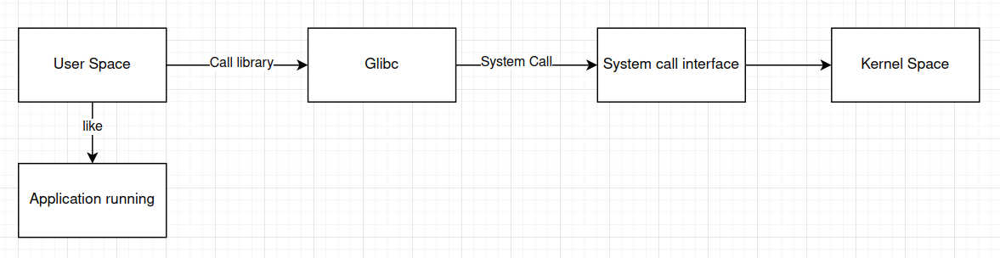
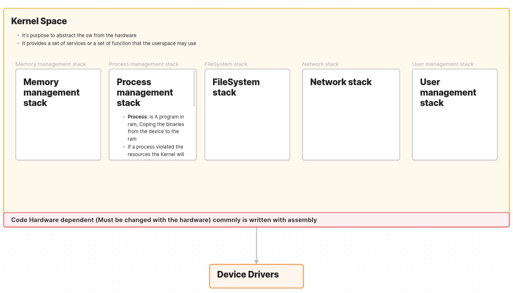
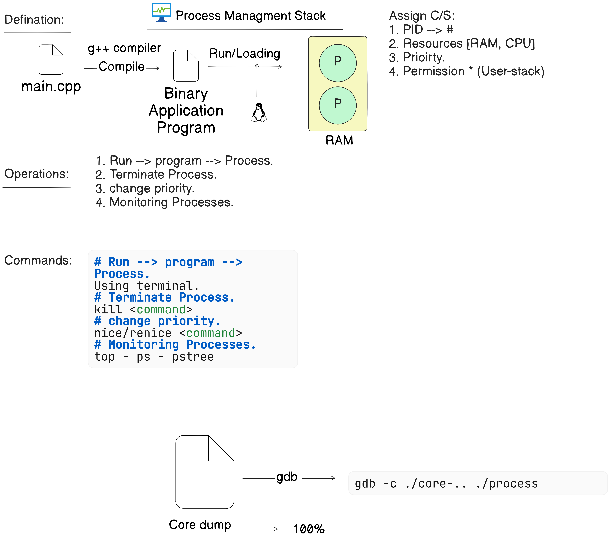

### **Linux Layered Diagram**
1. **User space**  : Where the user application can run , User space can call the Kernel using using system call interface
2. **Kernel Space** : the abstraction Layer between the application and the hardware 
3. **Drivers**  : The drivers of the hardware modules
4. **Hardware** (Rasp) 

---
### Workflow:

---
### Kernel Space:

---
### process management stack:

