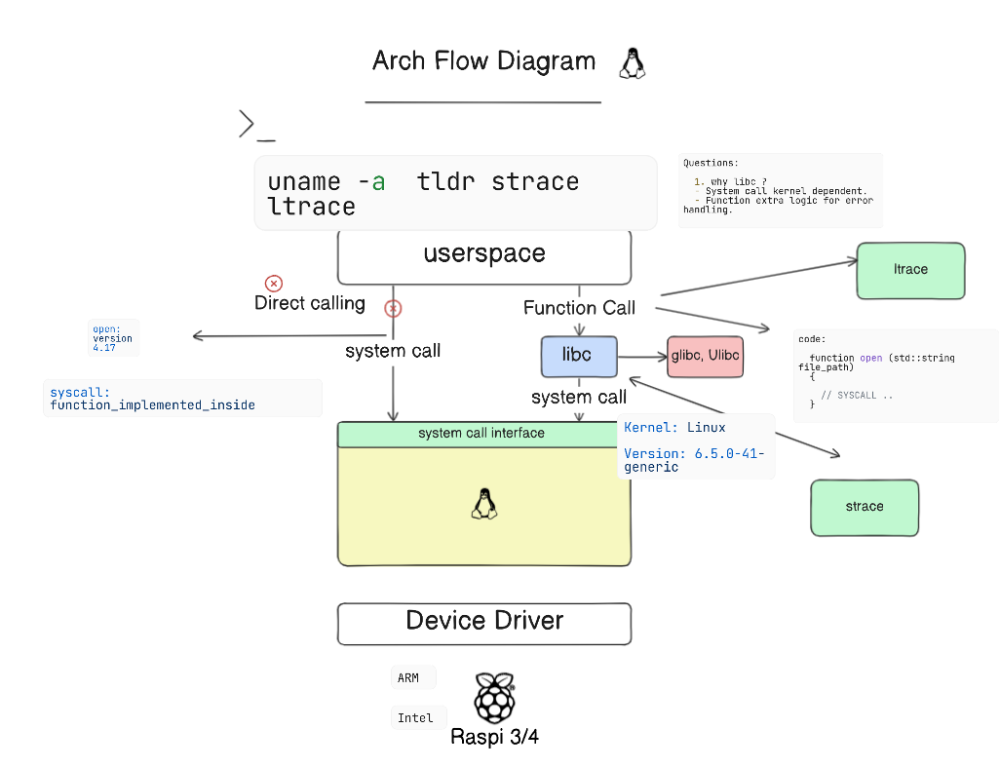
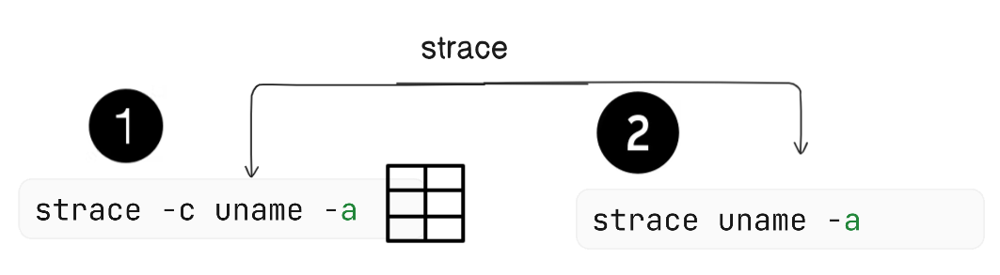
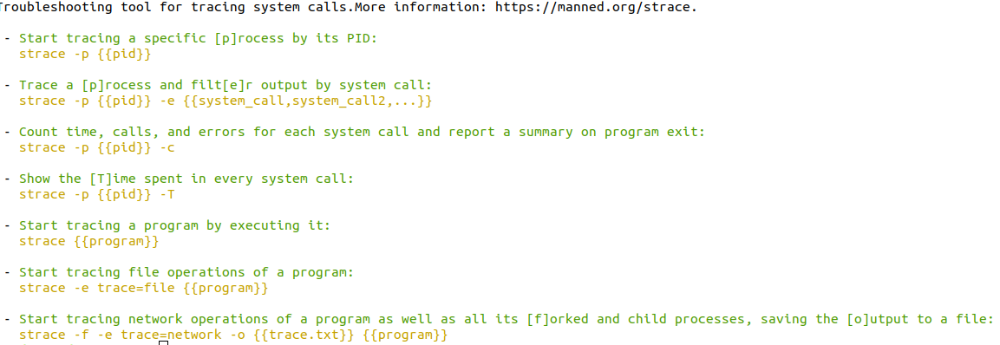
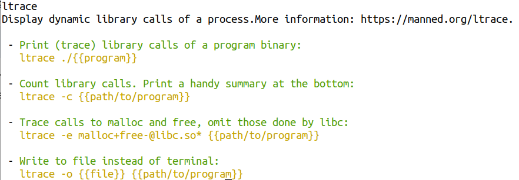

# 🧙🏻‍♂️ System Call Interface 🧙🏻 :

### 🧠 WorkFlow:

---

### 🔧 Commands :
We have to main commands :
1. `strace`: i**s a powerful Linux command-line tool that intercepts and records system calls made by a process. It provides detailed information about the system calls**.
   - use case: 
        1. Create a c file 
        2. Compile it
        3. Run the executable file with `strace` command
        4. The output will show the system calls made by the executable file

    - 

    - 

2. `ltrace` :**is primarily concerned with library calls. It intercepts and records function calls made by a process**

    - 

---
