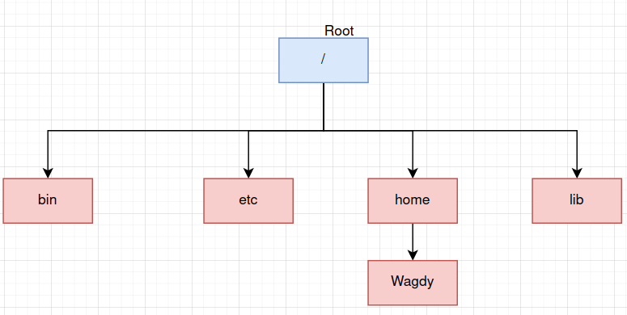
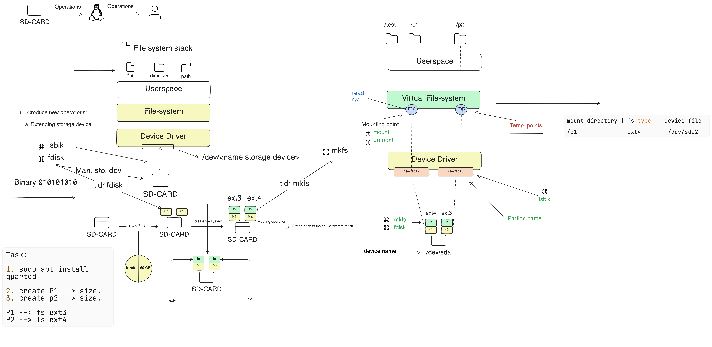
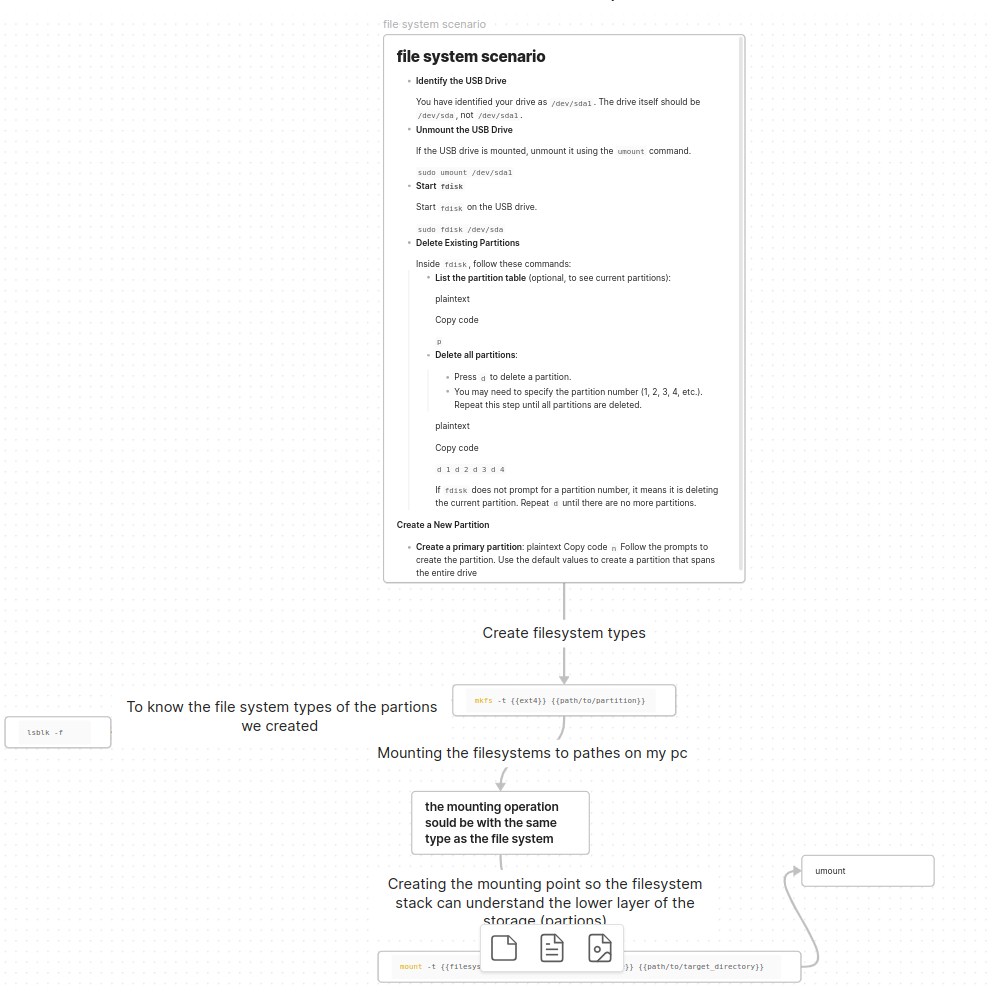

# 📑 File System stack:
### **Architecture**




### **File System Stack:**
- **The file system stack is layerd between the user space and the hardware**.
- **The file system stack is responsible for managing the files and directories in the system**.
- **The file system is resposible for the mounting and unmounting of the file system**.
- **when it comes to mounting the devices in the system , The file system stack will make a directory in the system and mount the device in it , so the user can access the device through this directory**.

- **Linux uses different file systems like `ext2`, `ext3`, `ext4`, and `vfat`**. 
- **Linux Can read the Windows file system (`NTFS`) and the Mac file system (`HFS`+)**.
- **Windows can't read the Linux file system**.
- **When We connect an external device to linux we follow the following procedure**:
    1. Connect the device to the system.
    2. The system will detect the device you can see by using `lsblk`.
    3. You should create partition in the device using `fdisk`.

    4. You should specify the file system type using `mkfs`.

    5. You should mount the device to a directory in the system using `mount`.<br>





---

### Example with steps:
- **Identify the USB Drive**
    
    You have identified your drive as `/dev/sda1`. The drive itself should be `/dev/sda`, not `/dev/sda1`.


- **Unmount the USB Drive**
    
    If the USB drive is mounted, unmount it using the `umount` command.
    
    
    `sudo umount /dev/sda1`<br>


    
- **Start `fdisk`**
    
    Start `fdisk` on the USB drive.
    
    `sudo fdisk /dev/sda`<br><br>


- **Delete Existing Partitions**
    
    Inside `fdisk`, follow these commands:
    
    - **List the partition table** (optional, to see current partitions):
        
        `p`


    - **Delete all partitions**:
        
        - Press `d` to delete a partition.
        - You may need to specify the partition number (1, 2, 3, 4, etc.). Repeat this step until all partitions are deleted.
     
        `d 1 d 2 d 3 d 4`
        
        If `fdisk` does not prompt for a partition number, it means it is deleting the current partition. Repeat `d` until there are no more partitions.


- **Create a New Partition**

    - **Create a primary partition**:
    `n`
    
    Follow the prompts to create the partition. Use the default values to create a partition that spans the entire drive

- **Create filesystem types**
    - ```bash
        sudo mkfs -t {{ext4}} {{path/to/partition}}
      ```
- **Mount the USB Drive**
    
    Mount the USB drive to a directory of your choice.
    
    `sudo mount /dev/sda1 /mnt`<br>


