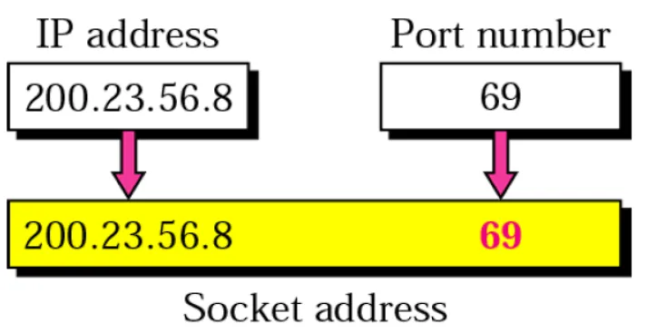
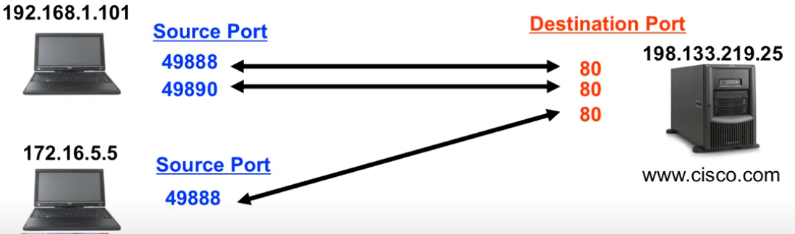

# 📌📌 Basic Network Stack
## What's Network?
Network is the way how two devices are communicating, The data sent between the two devices are called `packets`


## Communication protocol:
It's the way that the two devices are using to communicate with each others, we will use `SomeIp` it's a protocol used in the automotive industry.
- **Remote Process Communication:** Communication between two machines.
- **Inter-Process Communication:** Communication between two processes on the same machine.


## Communication Types:


## TCP/IP Layers and Protocols
1. **Application Layer**
Communication Protocol installed over that layer to be communicated with:
`http` , `https`, `SOMEIP`, `ssh`.

2. **Transport Layer**
Communication Protocol installed over that layer to be communicated with:
`TCP`, `UDP`.

3. **Network Layer**
Communication Protocol installed over that layer to be communicated with:
`IP-protocol`.

4. **Network Access Layer**
Communication Protocol installed over that layer to be communicated with:
`Ethernet`, `Wifi`, `Bluetooth`.


## The Ethernet Frame stages:
1. When a two Network cards are communicating they send Ethernet frames to each ohters, The receiver one start By comparing the Destination address with it's own MacAdress,If matched it start analysing the data and take the subFrame to another stage.


<br>


2. Then the subFrame goes to the network stack Layes as shown in fig


## ❗ Useful Commands and Tools

1. **`ifconfig -a`:** Displays all network interfaces and their MAC addresses.
    
    - ***NIC Information***:
        - **MAC Address:** A unique identifier for each NIC, assigned at the factory.
        - 
        - **IP Address:** Can be dynamically assigned by the router.

    - ***NIC Status***:

        - **Up:** The NIC is ready to transmit data.
        - **Down:** The NIC is disabled and cannot transmit data.
        - 
        - The `enp4s0` ,`lo` (Virtual NIC) ,`wlp0s20f3` all of them are network interfaces cards.

    -   The `mtu` (Maximum Transmission Unit) defines the largest packet size that can be transmitted over the NIC.

2. **`ethtool`:** Network interface setting and display properties.
3. **`ping`:** Verifies connectivity between two IP addresses, utilizing the `ICMP` protocol.
4. **`tcpdump`:** Captures network traffic and saves it for analysis.


## Wireshark
We are going to use the wireshark to analyse the data, The layers in the wireshark are ordered from the physical layer up to the application layer


## Ping and ICMP Protocol
The `ping` command uses the `ICMP` protocol to check if two machines can communicate. It sends an echo request and listens for an echo reply, verifying connectivity.

## Capturing and Analyzing Traffic
For systems without GUI tools like rasperryPi ,We Use `tcpdump` To capture network traffic and save it to file called pcap. The captured data can be transferred to another system for analysis with Wireshark.

---

# 📌📌 Advanced Network Stack
> In this part ana h3ml network so8aira a apply fiha el concepts ely 3arfinha 
### ⚙️ Create a simple Network

1. Identify Interface cards using `ifconfig -a`.
2. Connect Wirless/Wired to router (Sending Hidden Frame to the router to get the IP address) Using protocol called `DHCP -> Dynamic Host Configuration protocol`.
    - **DHCP**:
        - **Client:** Requests an IP address from the DHCP server.
        - **Server:** Assigns an IP address to the client.
        - **Router:** Manages the DHCP server.
    - To see the DHCPclient file go to ```/etc/dhcp/dhclient.conf```   
3. We have to configurations of the IP address:
    - **Static IP:** Manually assign an IP address to the interface *Which we are going to use*.
        - **Advantages:**
            - The IP address is always the same.
            - Easier to connect to the machine.
            - The assignation of it depends on the init process of the system you are using , in Out case we are using `systemd`. for more info -> [ ClickHere ](https://docs.google.com/document/d/1LoyayCG_EtRMXx-MLnoz4udPM-HQbzcM1bn-JBzJ5Ns/edit?usp=sharing)
    - **Dynamic IP:** Automatically assign an IP address using DHCP.

4. Assign static IP address.
5. Make sure that the machine is connected


---
### Inside the System-D :
- Network manager :
    - To show all the connections you did in the machine , use `nmcli connection show`.

    - To show more details about the connections and from where this command get the data go to `etc/NeworkManager/system-connections/` *(law 3ayz tshof details aktar)*.

    - To change the IP to be static use `nmcli connection modify <name of the connection> ipv4.method manual ipv4.addresses "IP address"` We use ipv4.method manual to make the IP static cuz it's dynamic by default ,also *Don't forget to restart the service using systemctl restart Networkmanager*. 

### Debugging Commands:
- **`ping`:** Check if the Other IP is working successfully and can recieve and send.

- **`ip addr show`:** Displays the IP address of the network interfaces.

- **`ip route show`:** Displays the routing table.

- **`netstat`:** Displays network connections, routing tables, and interface statistics.

- **`ss`:** Displays socket statistics.

- **`host`:** Resolves hostnames to IP addresses.

- **`nslookup`:** Queries DNS servers.

- **`ifconfig`:** Displays network interfaces and their configurations.

- **`ethtool`:** Displays NIC settings.


## Sockets:

**What are Sockets?**

A socket is essentially a unique identifier for a communication It consists of an IP address and a port number.

* **IP Address:** This identifies the specific device or machine on the network.
* **Port Number:** This differentiate services or applications running on the same machine.




## **Differentiating Sockets**

Consider the following scenario: Two devices on the same network are both using port 49888. How does the server know which device to send data to?

The answer lies in the sockets. Even though the port numbers are the same, the IP addresses are different. This means each device has a unique socket, allowing the server to distinguish between them and send data to the correct destination.




## **Sockets Commands**

`ss -tuln` : Displays all listening ports on the machine.

`netstat --listening --program --numeric --tcp --udp --extend` : Displays all listening ports and the programs using them.

`sudo tcpdump -i wlp3s0 -w <file>.pcap src 192.168.5.102` : Captures network traffic on 192.168.5.102 and saves it to a pcap file to analyze it using Wireshark.


## Socket Programming with example:
#### the procedure of the socket programming to make Server-client app
NOTES To be edited:
When we create a socket using the function `socket` it return an integer this integer represents the **file descriptor(Fd)** of the socket, and we use this file descriptor to communicate with the socket.


**`read` Function:**

- **Purpose:** Reads data from a socket.
- **Syntax:**
   ```c++
   ssize_t read(int sockfd, void *buf, size_t len);
   ```
- **Parameters:**
   - `sockfd`: The file descriptor of the socket.
   - `buf`: A pointer to the buffer where the received data will be stored.
   - `len`: The maximum number of bytes to read.
- **Return Value:**
   - Returns the number of bytes actually read, or -1 if an error occurs.

**`write` Function:**

- **Purpose:** Writes data to a socket.
- **Syntax:**
   ```c++
   ssize_t write(int sockfd, const void *buf, size_t len);
   ```
- **Parameters:**
   - `sockfd`: The file descriptor of the socket.
   - `buf`: A pointer to the buffer containing the data to be written.
   - `len`: The number of bytes to write.
- **Return Value:**
   - Returns the number of bytes actually written, or -1 if an error occurs.

**`send` Function:**

- **Purpose:** Sends data to a socket, potentially with flags to control the behavior.
- **Syntax:**
   ```c++
   ssize_t send(int sockfd, const void *buf, size_t len, int flags);
   ```
- **Parameters:**
   - `sockfd`: The file descriptor of the socket.
   - `buf`: A pointer to the buffer containing the data to be sent.
   - `len`: The number of bytes to send.
   - `flags`: Optional flags to control the behavior of the send operation. Some common flags include:
     - `MSG_DONTWAIT`: Non-blocking operation.
     - `MSG_NOSIGNAL`: Suppress SIGPIPE signal on write errors.
     - `MSG_EOR`: Indicates end-of-record.
- **Return Value:**
   - Returns the number of bytes actually sent, or -1 if an error occurs.

> The server reads data from the client using read, processes it, and sends it back using write. The client sends a message to the server using send.