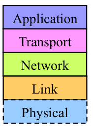

## What's Network?
Network is the way how two devices are communicating, The data sent between the two devices are called `packets`

## Communication protocol:
It's the way that the two devices are using to communicate with each others, we will use `SomeIp` it's a protocol used in the automotive industry.
If two machine are communication this is called `Remote process communication`,If two process on the same machine this is called `Inter process communication`

## Commands
`ifconfig` : configure a network interface , Interface cards up only
`ip` : show routing, network devices, interfaces

The number next to the network card is the `mac-Adress`

\
The mac-adress is uniqueID for every Network interface card 

## The Ethernet Frame stages:
\
1. When a two Network cards are communicating they send Ethernet frames to each ohters, The receiver one start By comparing the Destination address with it's own MacAdress,If matched it start analysing the data and take the subFrame to another stage

2. Then the subFrame goes to the network stack Layes as shown in fig

\

3. In the Network We compare with the 

`Transport layer will deal with the sockets and ports`

`ethtool` used to check the network interface card if there any issue in the driver or the hardware itself 

in the `ifconfig` the `mtu` is the maximux transimition unit ,it's the maximu....

## The layers in the wire shark are orderd from the physical layer up to down till the app layer

## Ping command we will use to check if the two Ip's or the two devices can see each other, If we opened the WireShark You will find A protocol called  `ICMP` if you clicked on it you will find the echo ping request

# command 'tcpdump' is also used to capture the frames and packets comming to the network interface

# we will use tcpdump tool to capture the traffic and save it to file called pcap, then take the pcap file and analyse it on the wireshark

