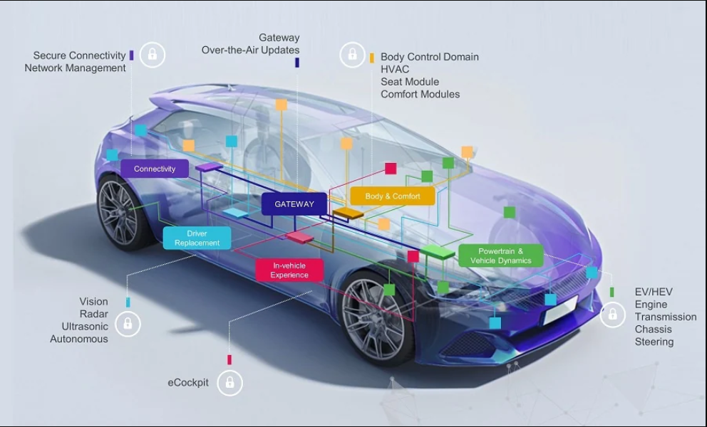
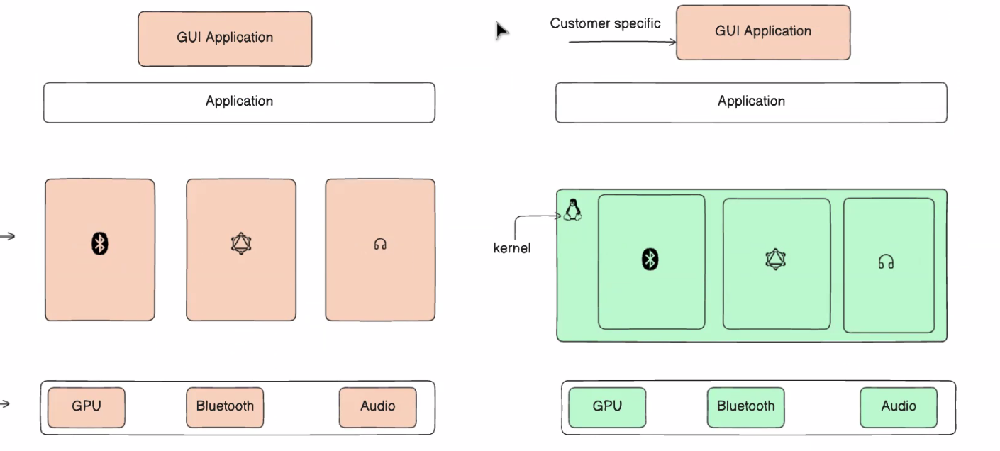
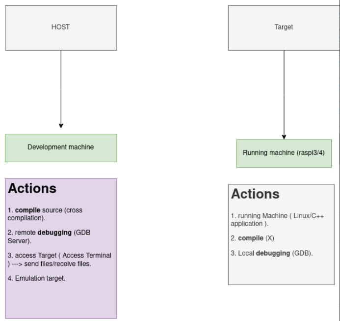

## Why Embedded Linux ?

Bare metal embedded can't fullfil the portabilty of the embeddded linux , cuz the device drivers is dependant on the hardware used , so If we changed the soc or the hardware we will have to rewrite new device drivers. Here comes the idea of the `embedded linux`!

Embedded linux gives us the ability to customize and and edit to add features to our system

---

 
 

**We have two Concepts the `HOST` and the `target`, the `host` is the machine that we are working on and the `target` is the machine that we are going to run the application on.**

 

---

# Embedded Linux Components
We have 3 main components in the embedded linux system:

0. Toolchain
1. Bootloader
2. Kernel
3. Root File System

 

