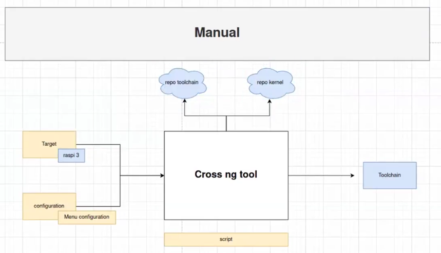

# Creating a custom tool-chain:
**After we saw in the intro what's the main components of Linuc system we are goin to start with customizing the tool chain**




<br>

---
We are going to create a custom toolchain with tool called `crosstool-ng` , Crosstool offers us more customizations to create a toolchain for a specific architecture like `Raspberry Pi`.


# Installing cross-tool-ng

1. Setting up Toolchain 
-    ```bash
        sudo apt-get install autoconf automake bison bzip2 cmake flex g++ gawk gcc gettext git gperf help2man libncurses5-dev libstdc++6 libtool libtool-bin make patch python3-dev rsync texinfo unzip wget xz-utils

     ```

2. clone the crosstool-NG repository, configure, build, and install it
-    ```bash
        bin/ct-ng distclean      #This cleans if there is any previous configurations file (.conf)
        bin/ct-ng list-samples   # List all the available archetectures and toolchains supported , we are going to choose the rasp4
        bin/ct-ng <choose sample>  # Choose the rasp4
        bin/ct-ng menuconfig       # Configure the t    oolchain we want, it will open a menu to choose the OS and C complier and kernel version and more 
        bin/ct-ng build            # Build the toolchain with the configurations , it will take some time
     ```

3. It's going to take time to build , after the building you will find the toolchain in the `~/x-tools` directory     


4. (optional step) to add the toolchain to the PATH for easy access
-    ```bash
        sudo nano ~/.bashrc
        #then scroll down to last line and paste the following:
        PATH=/home/wagdy/x-tools/aarch64-rpi4-linux-gnu/bin:$PATH
        alias raspi4-g++=aarch64-rpi4-linux-gnu-g++
        alias raspi4-gcc=aarch64-rpi4-linux-gnu-gcc
        alias raspi4-=aarch64-rpi4-linux-gnu-
     ```

<br>


# Concepts to know:


<br>
 
## What's the meaning of sysroot ?
**(copy of the root file system of the target device)**
it's the rootfile system of the target device , it's the directory that contains the libraries and headers files that the target device needs to compile the code and build the apps.


<br>

## Booting sequence of the embedded linux system
1. bios               : is the first thing that runs when the device is powered on , it's also usde to make hardware check like if there's a                       RAM problem the device will make beeeb sound and stop booting   
2. firts bootloader   : is used to make hardware cheks on the device 
3. second bootloader  : used for safety checks if th efist bootloader is corrupted and also used for debugging 
4. Third bootloader   : this one is optional in the devices not in all , but in our case it's called u-boot and for windows it's called GRUB
                        the third bootloader gives me the capability to choose the mode I'm booting to like the safe-mode or the normal mode recovery mode, can also choose which kernel to start for example if we have a dual booth on the device and we want to choose which device to boot from the third bootloadr will give us this capability.

4. kernel             : 
5. initramfs
6. root file system


the bootloader is a bare metal thing that's written in C and assembly , it's target dependant , it's the thing which calles the kernel 
