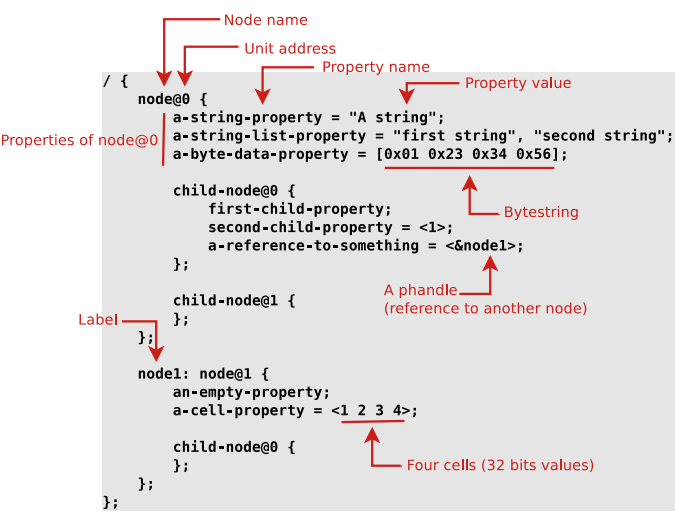

# Booting Sequence of the Embedded Linux systems:
> Interview Questions (From Lecture):
1. What's the first thing that runs when the device is powered on?
2. What's the first bootloader?
3. What's the second bootloader?
4. What's the third bootloader?
5. What's SOC? -> it's the system on chip , it's the processor and the peripherals on the same chip, it can be used for multiple purposes like the raspberry pi.


> Answers (From Lecture):
1. **Bios**               : is the first thing that runs when the device is powered on , it's also usde to make hardware check like if there's a RAM problem the device will make beeeb sound and stop booting   
2. **firts bootloader**   : is used to make hardware cheks on the device 
3. **second bootloader(SPL)**  : used for safety checks if th efist bootloader is corrupted and also used for debugging, it also init the DRAM(Dynamic ram) & Dram controller , then copies the U-boot(which's the third bootloader) to the RAM and then jumps to the U-boot code.
4. **Third bootloader**   : this one is optional in the devices not in all , but in our case it's called u-boot and for windows it's called GRUB
                        the third bootloader gives me the capability to choose the mode I'm booting to like )the safe-mode or the normal mode recovery mode, can also choose which kernel to start for example if we have a dual booth on the device and we want to choose which device to boot from the third bootloadr will give us this capability.

4. **kernel**             
5. **initramfs**
6. **root file system**


[!NOTE]
the bootloader is a bare metal thing that's written in C and assembly , it's target dependant , it's the thing which calles the kernel 


# Customizing the bootloader:
**After creating the toolchain we are going to use , Now it's the time to make our bootloader**
1. download the U-boot repo
    - ```bash
        git clone git://git.denx.de/u-boot.git
        ```
2. Go to u-boot directory
    - ```bash
        cd u-boot
        ```
3. To see the available configs based on the board or the soc you are using 
    - ```bash
        cd configs
        ls #this will list all the available configurations
        ```       
3. Make the U-boot configurations
    - ```bash
        #Note that you should have added the bin path of the tool chain , we discussed this in the previous README
        make rpi_4_defconfig
        ```
4. This will create a configuration file in the `u-boot` directory

5. Now we are going to build the U-boot
    - ```bash
        make -j8 -s 
        # Thiswillgenerate a u-boot binfile.
        ```
**Now we are done with the bootloader we will take this binfile and it on the Raspi4 board , and the next step is to create A kernel and we will make the bootloader boot it**


# Addional notes From Reference:
### What does the booloader do ?
1. **The bootloader does two main things, First is to pass a pointer ro struct containg the HW configs , Sec to pass another pointer to the kernel command line**
2. **Once the kernel has begun ,the bootloader is no longer needed and it's not used anymore.**
3. **Another susidiary job is to provide maintenance mode for updating boot configurations of looding new boot images ,or dunning diagnostics**
4. **It also load the kernel from the flash memory to `DRAM`**


# Tha phases of booting Sequence:
1. ### Phase-1 **ROM Code**
    - **First there's a code stored inside the ROM by the Vendor and cannot be changed**
    - **It Initialize the HW and clocks and memory and some basic perihperal**
    - **The ROM code determines from where the bootloader will be loaded , it can be from the SD card or the EMMC or the USB or the Ethernet**
    - **The ROM load the SPL (secondary program loader) to the SRAM , once it done it trasfer the control to it**


2. ### Phase-2 **Secondary program loader**
    - IT


<br>
<br>

---


# Device Tree:
### What's the Device tree?
- **The device tree is just a way to describe the HW components of computer system, It's a static data not an executable code**


### Where is the device tree located?
- **The Device tree is stored in the bootloader's firmware and then it's passed from the bootloader to the kernel.**
- **Or it can be stored in the kernel image itself.**


### How the Device tree code is written ?
 - **It consits of nodes and under each node there are properties**
 - **The nodes are the HW components like the CPU, the memory, the peripherals**
 - **It starts with the root node and it's written in the form of `/dts-v1/`**
 - **The properties are written in the form of `key = value;`**
 - **Every node represents a device or IP block**
 - **Note that the CPU and the memory**




# Real Example :


- **Note that the CPU has a property called `Compatible` this specifies the hardware device driver,it makes the kernel identify the CPU model and load the appropriate drivers and firmware.**


## The reg property:
- **The reg property is used to specify the address and the size of the memory mapped registers of the device.**

- 

- **The first value is the address and the second value is the size.**

-  ```c
    reg = <0x3F000000 0x100000>; //This means a single bank of memory that begins at 0x3F000000 and is 0x100000 bytes long.
    ``` 
- **But what if we want to make more that one bank memory ? We will have to assign values to `#address_cells` and `#size_cells`**

- 


## labels:
 - **The labels are used to refer to the nodes in the device tree(Every node might has a label), we use it if we want to make connections between the components**
 - **We can reference the node from another node by the label**
 - **Lables can be named `Phandles`**


## Includes in Device tree :
 - **The device tree can be splitted out into sections using the include files**
 - **There's a file with`.dtsi` extention, this is the include file of the device tree** 
 - **This include can be done with the normal include in C `#include "file.dtsi"`**


## Compiling the Device tree :
 - **The bootloader and the kernel needs a binary file to deal with so we have to compile the `.dtc` file to generate a binary called `.dtb`** 
 - **The figure below shows , we will use the `dtsi` header file and the `dts` file to generate the `.dtb` file , Very easy right :) ?** 

