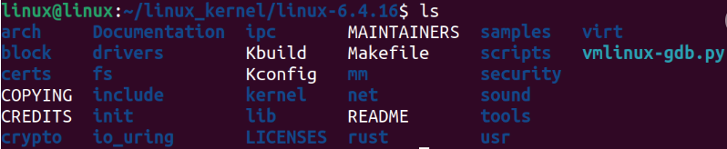
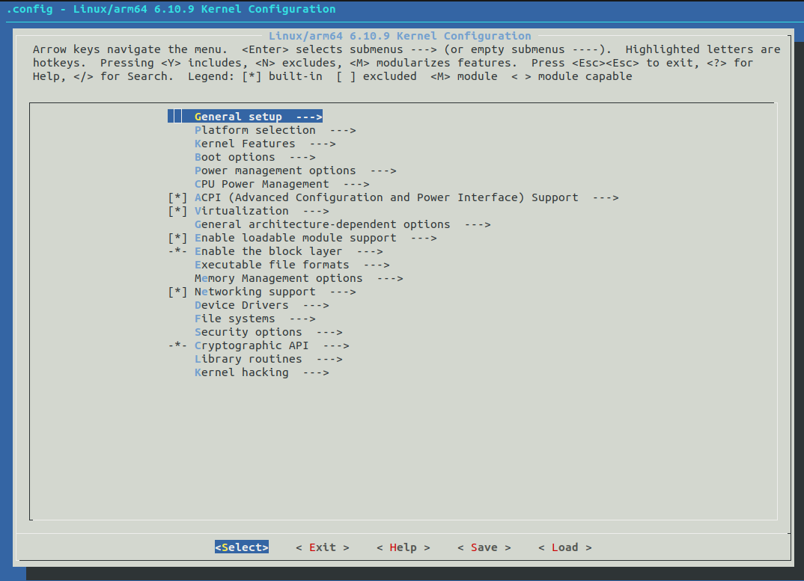
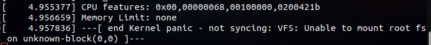

# Kernel Customization
**After we have sucessfully made the toolchain and the booloader , we are going to make the Kernel now**
we are going to follow the following steps to make the kernel:
### Pre-requisites:
```bash
sudo apt install libncurses5-dev flex bison
sudo apt install subversion libssl-dev 
sudo apt-get install qemu-system
sudo apt-get install device-tree-compiler
```


### 1. **Download the kernel source code**      [From here](https://kernel.org/)
**after this you will find the kernel source code in the `tar.xz` format , you can extract it using the following command:**
- ```bash
    tar -xvf linux-6.4.16.tar.xz
    ```
**you will find the content of it as the following :**

- 

### 2. **Configure the kernel**
**We have some KeyWords (menuConfig - KConfig - KBuild ) , a tool called `menuConfig` which will read the files named `Kconfig` then it will generate the `.config` file the `.Config` file will go to the KBuild then it will generate a configured Kernel**

- ```bash
    # make sure that you are in the Kernel directory
    make ARCH=arm64 CROSS_COMPILE=aarch64-rpi4-linux-gnu- distclean  #this will clean any old configurations
    make ARCH=arm64 CROSS_COMPILE=aarch64-rpi4-linux-gnu- menuconfig #this will open the menuconfig 

    ```
    **It will pop up a window like this:**

    - 

### 3. **Build the kernel**

-   We are going to use MAKE with the Customized Kernel
-  After building the kernel we will get a Vmlinux file , it's an elf file that is uncompressed
-  We Can use another way to use a compressed Kernel Image (zImage) ,it's just a compressed version of the Vmlinux file
-  We can also use another way to use a compressed Kernel Image (uImage), The Uimage is U-boot Kernel Image , the Uboot can Deal with it.
- Or we can use Distclean which will clean the kernel and remove the `.config` file
- So it's all based on the choice you give to the make command 
- 

    - ```bash
        # Choose one of the following option based on your app
        # vmLinux: elf file that is uncompressed
        make -j4 ARCH=arm64 CROSS_COMPILE=aarch64-rpi4-linux-gnu-
        # zImage: compressed 
        make -j4 ARCH=arm64 CROSS_COMPILE=aarch64-rpi4-linux-gnu- Imag
        # uImage: zImage + uBoot header 
        make -j4 ARCH=arm64 CROSS_COMPILE=aarch64-rpi4-linux-gnu- LOADADDR=0x80008000 uImage
        ```
- You will find the Image here in this path :
`/home/wagdy/Desktop/Embedded_linux/Kernel/linux-6.10.9/arch/arm64/boot` it will be named with Image 

### 4. **Booting the kernel**
- **If you wrote the following command it will boot the kernel in the QEMU , but at the end you will face a kernel panic because there's no FS which we are going to do in the next README**
-   ```bash
    qemu-system-aarch64 -M virt -cpu cortex-a53 -m 1G -kernel Image -append "console=ttyAMA0" -nographic
    ```
- 

> Note that the only way to exit is to kill the process by using 
```bash
kill -TERM <PID>
```


 