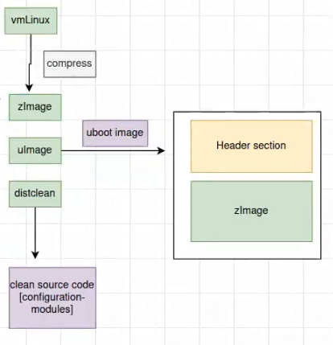

# Kernel Customization
**After we have sucessfully made the toolchain and the booloader , we are going to make the Kernel now**
we are going to follow the following steps to make the kernel:
1. **Download the kernel source code**      [From here](https://kernel.org/)
2. **Configure the kernel**
    - We have some expressions (menuConfig - KConfig - KBuild ) We are going to discuss that later
    - After changing in the menuConfig By the Kconfig it will generate the `.config` file
    - the `.Config` file will go to the KBuild then it will generate a configured Kernel

3. **Build the kernel**
    -  We are going to use MAKE with the Customized Kernel
    - After building the kernel we will get a Vmlinux file , it's an elf file that is uncompressed
    - We Can use another way to use a compressed Kernel Image (zImage) ,it's just a compressed version of the Vmlinux file
    - We can also use another way to use a compressed Kernel Image (uImage), The Uimage is U-boot Kernel Image , the Uboot can Deal with it.
    - Or we can use Distclean which will clean the kernel and remove the `.config` file
    - So it's all based on the choice you give to the make command 
    - 
4. **Booting the kernel**

 