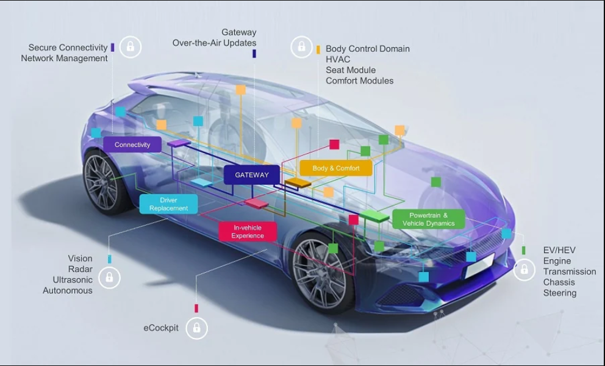
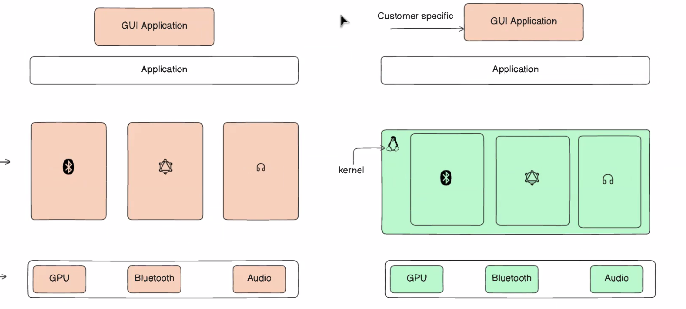
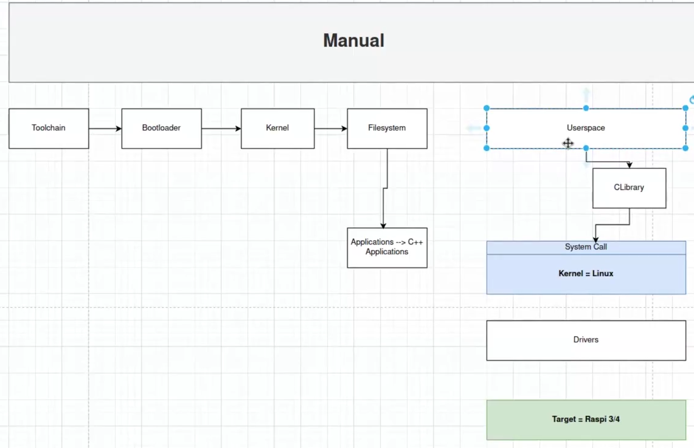

## Why Embedded Linux ?



Bare metal embedded can't fullfil the portabilty of the embeddded linux , cuz the device drivers is dependant on the hardware used , so If we changed the soc or the hardware we will have to rewrite new device drivers. Here comes the idea of the `embedded linux`!

Embedded linux gives us the ability to customize and and edit to add features to our system




---

# Embedded Linux Components
We have 3 main components in the embedded linux system:
0. Toolchain
1. Bootloader
2. Kernel
3. Root File System


<br>

We are going to create a custom toolchain with tool called `crosstool-ng` , Crosstool offers us more customizations to create a toolchain for a specific architecture like Raspberry Pi.




# Installing cross-tool-ng

1. Setting up Toolchain 
-    ```bash
        sudo apt-get install autoconf automake bison bzip2 cmake flex g++ gawk gcc gettext git gperf help2man libncurses5-dev libstdc++6 libtool libtool-bin make patch python3-dev rsync texinfo unzip wget xz-utils

     ```

2. clone the crosstool-NG repository, configure, build, and install it
-    ```bash
        bin/ct-ng distclean      #This cleans if there is any previous configurations file (.conf)
        bin/ct-ng list-samples   # List all the available archetectures and toolchains supported , we are going to choose the rasp4
        bin/ct-ng <choose sample>  # Choose the rasp4
        bin/ct-ng menuconfig       # Configure the toolchain we want, it will open a menu to choose the OS and C complier and kernel version and more 
        bin/ct-ng build            # Build the toolchain with the configurations , it will take some time
     ```
