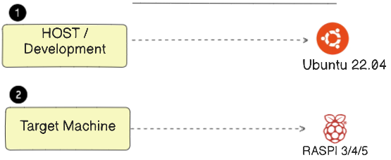
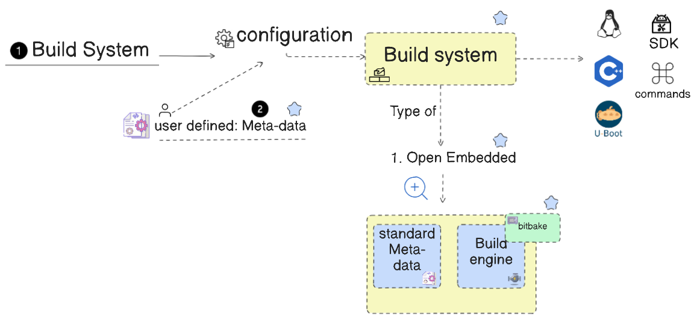
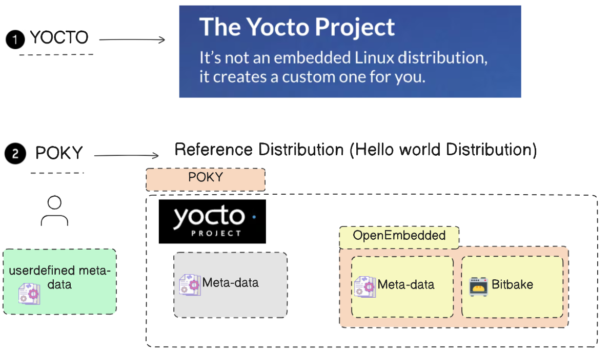
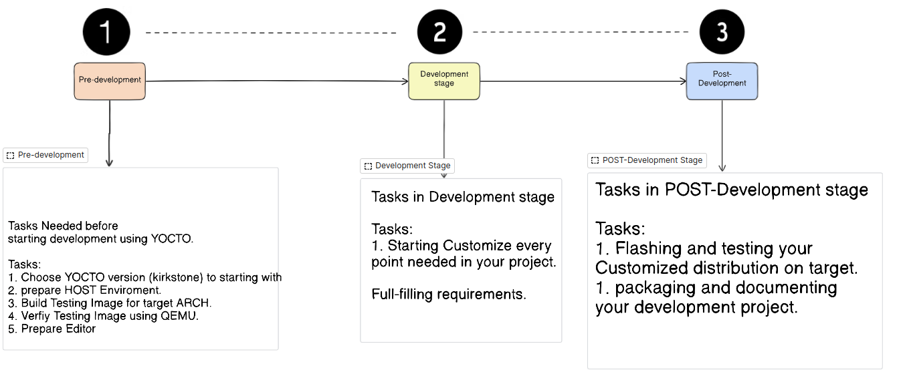

# Yocto Project:
### Concepts:
**Host or Development**: Our devices that we use (Ubuntu) , Wehere we are going to develop the c++ apps and then generate a Linux Images and then flash it to the target
**Target Machine** : Can be Raspi 3,4,5 , The machine runs the SW and install & flash the sw



**Cross-compilation vs Native compilation**:
- **Cross-compilation**: The compilation of the code is done on the host machine and the output is generated for the target machine
- **Native compilation**: The compilation of the code is done on the target machine itself


## Intro to yocto:
There are keywords we should know (`Yocto`,`Build system`, `Meta-data`, `OpenEmbedded` ,`Bitbake`, `Poky`)



- Yocto is not a linux dirtrpo but it helps you to customize one 

- The build system takes some configurations as `Meta-data` and then goes to `openEmbedded` , inside the openEmbedded there is a tool called `Bitbake` that takes the configurations and then generates the image for the target 

- `BitBake is just like a engine that takes the configurations and then generates the image for the target`

- The keyword POCKY is the mimial distribution of the Yocto project , it's like a hello world distrpo so you can start from it and then customize it




## Stages of working with Yocto:




## Getting started with Yocto:
- **Prerequisites**:
    - Create a bash script called `flashing.sh` and paste the following content:
    ```bash
    #!/usr/bin/bash

    function sdcard-flashing(){
    
    if [[ "$1" == "--help" ]]; then
        printf "%s\n%s\n" "1st parameter: /dev/<driver>" "2nd parameter: <image iso>"
        return 0
    fi
    

    if (( $# < 2 )); then
        echo "Invalid arguments passed use --help for valid options."
        return 1
    fi

    declare DRIVER=$1
    declare IMAGE_PATH=$2
    
    sudo dd if="${IMAGE_PATH}" of="${DRIVER}" status=progress

    return 0
    }


    function create-rpi-image(){

    if [[ "$1" == "--help" ]]; then
        printf "%s\n%s" "1st parameter: image-name" "RUN: wic list images"
        return 0
    fi
    

    if (( $# < 1 )); then
        echo "Invalid arguments passed use --help for valid options."
        return 1
    fi

    declare IMAGE-NAME=$1
    
    sudo wic create  sdimage-raspberrypi -e ${IMAGE-NAME}

    return 0
    }
     ```

     - Add it to the `.bashrc` file to source it by using the following commands:

     ```bash
     sudo nano ~/.bashrc
        # Add the following line to the end of the file # Don't forget to change the path to the correct one
    if [ -f "/home/wagdy/Desktop/Embedded_linux/YOCTO_TRAINING/flashing.sh" ]; then
    source "/home/wagdy/Desktop/Embedded_linux/YOCTO_TRAINING/flashing.sh"
    fi

    ```

- **Step 1**: Install the required packages:
```bash
sudo apt install gawk wget git diffstat unzip texinfo gcc build-essential chrpath socat cpio python3 python3-pip python3-pexpect xz-utils debianutils iputils-ping python3-git python3-jinja2 libegl1-mesa libsdl1.2-dev python3-subunit mesa-common-dev zstd liblz4-tool file locales libacl1
sudo locale-gen en_US.UTF-8
```

- **Step 2**: Choose the yocto release [from here](https://wiki.yoctoproject.org/wiki/Releases):
```bash
# We are going to use specific one , you can get it directly from here: 
# clone poky.
git clone -b kirkstone https://github.com/yoctoproject/poky.git
# switch directory.
cd poky
```

- **Step 3**: Initialize the build environment:
```bash
source oe-init-build-env
cd conf/
```

- **Step 4**: Edit the `local.conf` file:
```bash
nano local.conf 
```
- Chane this line to be your target here we are going to use `qemuarm64`:
```bash
MACHINE ??= "qemuarm64"
```
- also add the following two lines below :
```bash
BB_NUMBER_THREADS="8" # specify the number of threads to use
PARALLEL_MAKE="-j 8"  # specify the number of threads to use
```


- **Step 5**: Build the image(It will take so damn long no worries):
```bash
bitbake core-image-minimal
```

- **Step 6**: After it finishs, Hah congratulations first :)) , Now you can flash the image to the target:
```bash
# We will use Qemu simulation , you can use it with real HW
runqemu qemuarm64 nographic
```