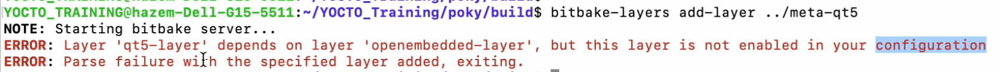

# Yocto Project:
### Concepts:
**Host or Development**: Our devices that we use (Ubuntu) , Wehere we are going to develop the c++ apps and then generate a Linux Images and then flash it to the target
**Target Machine** : Can be Raspi 3,4,5 , The machine runs the SW and install & flash the sw


**Cross-compilation vs Native compilation**:
- **Cross-compilation**: The compilation of the code is done on the host machine and the output is generated for the target machine
- **Native compilation**: The compilation of the code is done on the target machine itself


## Intro to yocto:
There are keywords we should know (`Yocto`,`Build system`, `Meta-data`, `OpenEmbedded` ,`Bitbake`, `Poky`)


- Yocto is not a linux dirtrpo but it helps you to customize one 

- The build system takes some configurations as `Meta-data` and then goes to `openEmbedded` , inside the openEmbedded there is a tool called `Bitbake` that takes the configurations and then generates the image for the target 

- `BitBake is just like a engine that takes the configurations and then generates the image for the target`

- The keyword POCKY is the mimial distribution of the Yocto project , it's like a hello world distrpo so you can start from it and then customize it


## Stages of working with Yocto:


## Getting started with Yocto:
- **Prerequisites**:
    - Create a bash script called `flashing.sh` and paste the following content:
    ```bash
    #!/usr/bin/bash

    function sdcard-flashing(){
    
    if [[ "$1" == "--help" ]]; then
        printf "%s\n%s\n" "1st parameter: /dev/<driver>" "2nd parameter: <image iso>"
        return 0
    fi
    

    if (( $# < 2 )); then
        echo "Invalid arguments passed use --help for valid options."
        return 1
    fi

    declare DRIVER=$1
    declare IMAGE_PATH=$2
    
    sudo dd if="${IMAGE_PATH}" of="${DRIVER}" status=progress

    return 0
    }


    function create-rpi-image(){

    if [[ "$1" == "--help" ]]; then
        printf "%s\n%s" "1st parameter: image-name" "RUN: wic list images"
        return 0
    fi
    

    if (( $# < 1 )); then
        echo "Invalid arguments passed use --help for valid options."
        return 1
    fi

    declare IMAGE-NAME=$1
    
    sudo wic create  sdimage-raspberrypi -e ${IMAGE-NAME}

    return 0
    }
     ```

     - Add it to the `.bashrc` file to source it by using the following commands:

     ```bash
     sudo nano ~/.bashrc
        # Add the following line to the end of the file # Don't forget to change the path to the correct one
    if [ -f "/home/wagdy/Desktop/Embedded_linux/YOCTO_TRAINING/flashing.sh" ]; then
    source "/home/wagdy/Desktop/Embedded_linux/YOCTO_TRAINING/flashing.sh"
    fi

    ```

- **Step 1**: Install the required packages:
```bash
sudo apt install gawk wget git diffstat unzip texinfo gcc build-essential chrpath socat cpio python3 python3-pip python3-pexpect xz-utils debianutils iputils-ping python3-git python3-jinja2 libegl1-mesa libsdl1.2-dev python3-subunit mesa-common-dev zstd liblz4-tool file locales libacl1
sudo locale-gen en_US.UTF-8
```

- **Step 2**: Choose the yocto release [from here](https://wiki.yoctoproject.org/wiki/Releases):
```bash
# We are going to use specific one , you can get it directly from here: 
# clone poky.
git clone -b kirkstone https://github.com/yoctoproject/poky.git
# switch directory.
cd poky
```

- **Step 3**: Initialize the build environment:
This will create a new build environment adn setup some build scripts , it also sets some shell variables
```bash
source oe-init-build-env


# i have automated this step by adding the following lines to the ./bashrc file
# alias srcbuild='cd /home/wagdy/Desktop/Embedded_linux/YOCTO_TRAINING/poky && source oe-init-build-env'
# and then use the word srcbuild directly , easy right ?

cd conf/
```

- **Step 4**: Edit the `local.conf` file:
```bash
nano local.conf 
```
- Chane this line to be your target here we are going to use `qemuarm64`:
```bash
MACHINE ??= "qemuarm64"
```
- also add the following two lines below :
```bash
BB_NUMBER_THREADS="8" # Number of parallel BitBake tasks
PARALLEL_MAKE="-j 8"  # Number of parallel make tasks
```


- **Step 5**: Build the image(It will take so damn long no worries):
```bash
bitbake core-image-minimal
```

- **Step 6**: After it finishs, Hah congratulations first :)) , Now you can flash the image to the target:
```bash
# We will use Qemu simulation , you can use it with real HW
runqemu qemuarm64 nographic
```


# Yocto Architecture:
- **Layers**: is some directories contains thins related to each other , like `BSP` layer and `sw` layer and `distribution` Layer it also contains `Meta-data` which contains `Recipes` & `classes` & `conf` files
- **Purpose**: Each layer can be thought of as a modular piece of functionality. Layers allow the reuse of code, modularity, and easier maintenance.

**Example**: There could be a layer for a specific hardware platform (e.g., meta-raspberrypi), or for adding graphical interface components (e.g., meta-gnome).


- To create a layer we use 
```bash
#but don't forget to source the oe-init-build-env before 
bitbake-layers create-layer meta-my-layer
```
- **if you checked the directory you will find a dir named `meta-my-layer` contains the data of the layer like the conf files and the recipes**
- But now the created layers doesn't appear in the `bblayers.conf` file so we need to add it manually by using the following command:
```bash
#Don't forget to go to the build directory
cd build
bitbake-layers add-layer meta-my-layer
```


- To show the layers of the system :
```bash
bitbake-layers show-layers
```

- To  remove the layer :
```bash
# this will remove the layer from the variable `BBLAYERS` in the `bblayers.conf` file but it doesn't remove the layer from the disk
bitbake-layers remove-layer meta-my-layer
```

- To remove the layer from the disk:
```bash
#normal removing not related to the Bitbake
rm -rf meta-my-layer
```

- **Recipes**: is a file that contains the instructions to build a package , it contains the following:


# layers types:
- **BSP Layer**: This layer contains the board support package for a specific hardware platform. It includes the kernel, bootloader, and other hardware-specific configurations. 7agat el HW

- **SW Layer**: This layer contains the software packages that will be included in the final image. It includes libraries, applications, and other software components.

- **Distribution Layer**: This layer contains the configuration for the final image. It includes the list of packages to be included, the image type, and other configuration options.


# Let's get started:
We will follow the bottom up concept
- **We will take the BSP from the Vendor and integrate it in our system , we can also create one but that's not a common thing to do**

- **Go to OpenEmbedded and download the BSP for the RASP4, or just use the following command**
```bash
git clone -b kirkstone https://git.yoctoproject.org/meta-raspberrypi
```
- **This will download the BSP and put it to dir called `meta-raspberrypi`**

- **If you go to the path `meta-raspberrypi/recipes-core/images/rpi-test-image.bb` you will find core recipe file it has the name of the image we are going to generate**

- **Now just go to the `conf` dir and to the `local.conf` and change the `MACHINE` variable to .... but wait we don't know what's the options to put here**

- **To know the options that are available from the BCP, you can go to the `meta-raspberrypi/conf/machine` and you will find the available options** 

Here's the options you will find :


- **Now we can go to the `local.conf` and change the `MACHINE` variable to `raspberrypi4-64`**

- **Now we should build the image of the rasp4 we will use command bitbake and then the image name , the image name we got from`meta-raspberrypi/recipes-core/images/rpi-test-image.bb`**
```bash
bitbake rpi-test-image
```


- **After finishing the Building you will find the image in `build/tmp/deploy/images/raspberrypi4-64`** 


- **Then we are going to flash the image on rasperrypi using the functions we did in the script.sh file**


## Integrating SW Layer:
- We will download the meta-QT 5 layer , get it from the official repo 
```bash
git clone -b kirkstone https://github.com/meta-qt5/meta-qt5
```
- Then add the layer to our layers
```bash
bitbake-layers add-layer ../meta-qt5
```
> [!WARNING] 
> Add meta-QT layer then you will face the error then you will have to add another layer called `Meta-openEmbedded` inside it you will find another layer called `meta-oe` that's what we need 




Note in the following fig , it shows that it depends on another layers , so we gonna resolve those dependancies


- Download the `meta-openembedded` layer
```bash
git clone -b kirkstone https://git.openembedded.org/meta-openembedded
cd build 
bitbake-layers add-layer ../meta-openembedded/meta-oe/
# then add the QT again 
bitbake-layers add-layer ../meta-qt5
```


> [!TIP] 
> Make the layers little as much as you can to keep it simple


- We are going to create two distros as the project specs [here](https://docs.google.com/document/d/1UwGSS2bne5d9MHkHdl02wuWDoFDzq9el_CeK-qQZVSk/edit#heading=h.82jxa2s3zola) : 

    - first distrpo will be
        - Includes Meta-qt5.
        - Uses systemd as the init system.

    - second distro will be:
        - Excludes Meta-qt5.
        - Uses sysvinit as the init system.


## **To create the first distro**:
- First , Create a layer for the first distro:
```bash
bitbake-layers create-layer ../meta-info-distro
```

- Then add this layer to the layers of the bitbake
```bash
bitbake-layers add-layer ../meta-info-distro
```

- Then create the distro dir inside the conf file of the layer (`meta-info-distro -> conf -> distro`)

- then Create a file inside the distro called `audio.conf` and add the following content:

```bash
 # Distibution Information.
DISTRO="audio"
DISTRO_NAME="Bullet-audio"
DISTRO_VERSION="1.0"

MAINTAINER="hazemkhaled1024@gmail.com"


# SDK Information.
SDK_VENDOR = "-bulletSDK"
SDK_VERSION = "${@d.getVar('DISTRO_VERSION').replace('snapshot-${METADATA_REVISION}', 'snapshot')}"
SDK_VERSION[vardepvalue] = "${SDK_VERSION}"

SDK_NAME = "${DISTRO}-${TCLIBC}-${SDKMACHINE}-${IMAGE_BASENAME}-${TUNE_PKGARCH}-${MACHINE}"
# Installation path --> can be changed to ${HOME}-${DISTRO}-${SDK_VERSION}
SDKPATHINSTALL = "/opt/${DISTRO}/${SDK_VERSION}" 

# Disribution Feature --> NOTE: used to add customize package (for package usage).

# infotainment --> INFOTAINMENT

AUDIO_DEFAULT_DISTRO_FEATURES = "largefile opengl ptest multiarch vulkan bluez5 bluetooth wifi audio_only"
AUDIO_DEFAULT_EXTRA_RDEPENDS = "packagegroup-core-boot"
AUDIO_DEFAULT_EXTRA_RRECOMMENDS = "kernel-module-af-packet"

# TODO: to be org.

DISTRO_FEATURES ?= "${DISTRO_FEATURES_DEFAULT} ${AUDIO_DEFAULT_DISTRO_FEATURES} userland"

#adding the systemd as init-process
require conf/distro/include/systemd.conf

# prefered version for packages.
PREFERRED_VERSION_linux-yocto ?= "5.15%"
PREFERRED_VERSION_linux-yocto-rt ?= "5.15%"


# Build System configuration.

LOCALCONF_VERSION="2"

# add poky sanity bbclass
INHERIT += "poky-sanity"
```


##  **To create the Second distro**:

- Do the same as we did in the first one but for the file inside the ditro , name it `infotainment.conf`
then add the following content to it :

```bash
 # Distibution Information.
DISTRO="infotainment"
DISTRO_NAME="Bullet-Infotainment"
DISTRO_VERSION="1.0"

MAINTAINER="hazemkhaled1024@gmail.com"


# SDK Information.
SDK_VENDOR = "-bulletSDK"
SDK_VERSION = "${@d.getVar('DISTRO_VERSION').replace('snapshot-${METADATA_REVISION}', 'snapshot')}"
SDK_VERSION[vardepvalue] = "${SDK_VERSION}"

SDK_NAME = "${DISTRO}-${TCLIBC}-${SDKMACHINE}-${IMAGE_BASENAME}-${TUNE_PKGARCH}-${MACHINE}"
# Installation path --> can be changed to ${HOME}-${DISTRO}-${SDK_VERSION}
SDKPATHINSTALL = "/opt/${DISTRO}/${SDK_VERSION}" 

# Disribution Feature --> NOTE: used to add customize package (for package usage).

# infotainment --> INFOTAINMENT

INFOTAINMENT_DEFAULT_DISTRO_FEATURES = "largefile opengl ptest multiarch vulkan x11 bluez5 bluetooth wifi qt5"
INFOTAINMENT_DEFAULT_EXTRA_RDEPENDS = "packagegroup-core-boot"
INFOTAINMENT_DEFAULT_EXTRA_RRECOMMENDS = "kernel-module-af-packet"

# TODO: to be org.

DISTRO_FEATURES ?= "${DISTRO_FEATURES_DEFAULT} ${INFOTAINMENT_DEFAULT_DISTRO_FEATURES} userland"

#adding the systemd as init-process
require conf/distro/include/systemd.conf

# prefered version for packages.
PREFERRED_VERSION_linux-yocto ?= "5.15%"
PREFERRED_VERSION_linux-yocto-rt ?= "5.15%"


# Build System configuration.

LOCALCONF_VERSION="2"

# add poky sanity bbclass
INHERIT += "poky-sanity"

```


## Adding the systemd as init-process

Now we should add systemd as init-process to the distro with the qt which is the infotainment distro

- Go to the `meta-info-distro/conf/distro` and create a dir called `include` and and then create a file called `systemd.inc`
then add the following content to it :
```bash
# install systemd service  as init manager
DISTRO_FEATURES:append = " systemd"

# Add systemd as init manager
VIRTUAL-RUNTIME_init_manager = "systemd"

VIRTUAL-RUNTIME_initscripts = "systemd-compat-units"

```

- One more change , go to the conf file of the distro of infotainment in the path `meta-info-distro/conf/distro/infotainment.conf`  , and add the following line :

```bash
#adding the systemd as init-process
require conf/distro/include/systemd.conf
```

after those steps you should have the following structure :

 


# Recipes:
Inisde the layers there's something called recipes , there are 4 types of the recipes :
1. package recipes `.bb` : it may be application package recipe or Kernel Package recipe
2. Image recipes `.bb`
3. calss recipes  `.bbclass`
4. configuration  `.conf`


# Tools for recipes:
- **devtool**: is a tool that helps you to create a recipe for a package , it's like a wizard that helps you to create the recipe for the package

- **Recipetool** 

- **Bitbake-layers**: is a tool that helps you to add or remove layers from the bitbake


****************************************************** Session notes ************************************************************
- in the tmp dir we have another dir called deploy inside it you will find images dir, it will look so messy and we can't use all of this to flash the board so we will use the flashing script we have created in the `flashing.sh` file with a tool called `wic` to convert it to iso image 


- to make the sd-card bootable , we should have two partitionsthe boot partition should be `fat32` and the root partition should be `ext4` so we can create all of that manually or we can use tools like `wic` to do that for us


- Distro = Kernel + Application installed in the userspace , so we create the distro to give us the ability to edit the apps or the choosing the kernel version , it's like choosing between Ubuntu and Fedora both are distros but they have different apps and kernel versions


- Booting sequence of the Rasperrypi :
The bios of the rasp start searching for the bootable partition in the sd-card 