# Yocto Project:
### Concepts:
**Host or Development**: Our devices that we use (Ubuntu) , Wehere we are going to develop the c++ apps and then generate a Linux Images and then flash it to the target
**Target Machine** : Can be Raspi 3,4,5 , The machine runs the SW and install & flash the sw


**Cross-compilation vs Native compilation**:
- **Cross-compilation**: The compilation of the code is done on the host machine and the output is generated for the target machine
- **Native compilation**: The compilation of the code is done on the target machine itself


## Intro to yocto:
There are keywords we should know (`Yocto`,`Build system`, `Meta-data`, `OpenEmbedded` ,`Bitbake`, `Poky`)


- Yocto is not a linux dirtrpo but it helps you to customize one 

- The build system takes some configurations as `Meta-data` and then goes to `openEmbedded` , inside the openEmbedded there is a tool called `Bitbake` that takes the configurations and then generates the image for the target 

- `BitBake is just like a engine that takes the configurations and then generates the image for the target`

- The keyword POCKY is the mimial distribution of the Yocto project , it's like a hello world distrpo so you can start from it and then customize it


## Stages of working with Yocto:


## Getting started with Yocto:
- **Prerequisites**:
    - Create a bash script called `flashing.sh` and paste the following content:
    ```bash
    #!/usr/bin/bash

    function sdcard-flashing(){
    
    if [[ "$1" == "--help" ]]; then
        printf "%s\n%s\n" "1st parameter: /dev/<driver>" "2nd parameter: <image iso>"
        return 0
    fi
    

    if (( $# < 2 )); then
        echo "Invalid arguments passed use --help for valid options."
        return 1
    fi

    declare DRIVER=$1
    declare IMAGE_PATH=$2
    
    sudo dd if="${IMAGE_PATH}" of="${DRIVER}" status=progress

    return 0
    }


    function create-rpi-image(){

    if [[ "$1" == "--help" ]]; then
        printf "%s\n%s" "1st parameter: image-name" "RUN: wic list images"
        return 0
    fi
    

    if (( $# < 1 )); then
        echo "Invalid arguments passed use --help for valid options."
        return 1
    fi

    declare IMAGE-NAME=$1
    
    sudo wic create  sdimage-raspberrypi -e ${IMAGE-NAME}

    return 0
    }
     ```

     - Add it to the `.bashrc` file to source it by using the following commands:

     ```bash
     sudo nano ~/.bashrc
        # Add the following line to the end of the file # Don't forget to change the path to the correct one
    if [ -f "/home/wagdy/Desktop/Embedded_linux/YOCTO_TRAINING/flashing.sh" ]; then
    source "/home/wagdy/Desktop/Embedded_linux/YOCTO_TRAINING/flashing.sh"
    fi

    ```

- **Step 1**: Install the required packages:
```bash
sudo apt install gawk wget git diffstat unzip texinfo gcc build-essential chrpath socat cpio python3 python3-pip python3-pexpect xz-utils debianutils iputils-ping python3-git python3-jinja2 libegl1-mesa libsdl1.2-dev python3-subunit mesa-common-dev zstd liblz4-tool file locales libacl1
sudo locale-gen en_US.UTF-8
```

- **Step 2**: Choose the yocto release [from here](https://wiki.yoctoproject.org/wiki/Releases):
```bash
# We are going to use specific one , you can get it directly from here: 
# clone poky.
git clone -b kirkstone https://github.com/yoctoproject/poky.git
# switch directory.
cd poky
```

- **Step 3**: Initialize the build environment:
This will create a new build environment adn setup some build scripts , it also sets some shell variables
```bash
source oe-init-build-env


# i have automated this step by adding the following lines to the ./bashrc file
# alias srcbuild='cd /home/wagdy/Desktop/Embedded_linux/YOCTO_TRAINING/poky && source oe-init-build-env'
# and then use the word srcbuild directly , easy right ?

cd conf/
```

- **Step 4**: Edit the `local.conf` file:
```bash
nano local.conf 
```
- Chane this line to be your target here we are going to use `qemuarm64`:
```bash
MACHINE ??= "qemuarm64"
```
- also add the following two lines below :
```bash
BB_NUMBER_THREADS="8" # Number of parallel BitBake tasks
PARALLEL_MAKE="-j 8"  # Number of parallel make tasks
```


- **Step 5**: Build the image(It will take so damn long no worries):
```bash
bitbake core-image-minimal
```

- **Step 6**: After it finishs, Hah congratulations first :)) , Now you can flash the image to the target:
```bash
# We will use Qemu simulation , you can use it with real HW
runqemu qemuarm64 nographic
```


# Yocto Architecture:
- **Layers**: is some directories contains thins related to each other , like `BSP` layer and `sw` layer and `distribution` Layer it also contains `Meta-data` which contains `Recipes` & `classes` & `conf` files
- **Purpose**: Each layer can be thought of as a modular piece of functionality. Layers allow the reuse of code, modularity, and easier maintenance.

**Example**: There could be a layer for a specific hardware platform (e.g., meta-raspberrypi), or for adding graphical interface components (e.g., meta-gnome).


- To create a layer we use 
```bash
#but don't forget to source the oe-init-build-env before 
bitbake-layers create-layer meta-my-layer
```
- **if you checked the directory you will find a dir named `meta-my-layer` contains the data of the layer like the conf files and the recipes**
- But now the created layers doesn't appear in the `bblayers.conf` file so we need to add it manually by using the following command:
```bash
#Don't forget to go to the build directory
cd build
bitbake-layers add-layer meta-my-layer
```


- To show the layers of the system :
```bash
bitbake-layers show-layers
```

- To  remove the layer :
```bash
# this will remove the layer from the variable `BBLAYERS` in the `bblayers.conf` file but it doesn't remove the layer from the disk
bitbake-layers remove-layer meta-my-layer
```

- To remove the layer from the disk:
```bash
#normal removing not related to the Bitbake
rm -rf meta-my-layer
```

- **Recipes**: is a file that contains the instructions to build a package , it contains the following:


# layers types:
- **BSP Layer**: This layer contains the board support package for a specific hardware platform. It includes the kernel, bootloader, and other hardware-specific configurations. 7agat el HW

- **SW Layer**: This layer contains the software packages that will be included in the final image. It includes libraries, applications, and other software components.

- **Distribution Layer**: This layer contains the configuration for the final image. It includes the list of packages to be included, the image type, and other configuration options.


# Let's get started:
We will follow the bottom up concept
- **We will take the BSP from the Vendor and integrate it in our system , we can also create one but that's not a common thing to do**

- **Go to OpenEmbedded and download the BSP for the RASP4, or just use the following command**
```bash
git clone -b kirkstone https://git.yoctoproject.org/meta-raspberrypi
```
- **This will download the BSP and put it to dir called `meta-raspberrypi`**

- **If you go to the path `meta-raspberrypi/recipes-core/images/rpi-test-image.bb` you will find core recipe file it has the name of the image we are going to generate**

- **Now just go to the `conf` dir and to the `local.conf` and change the `MACHINE` variable to .... but wait we don't know what's the options to put here**

- **To know the options that are available from the BCP, you can go to the `meta-raspberrypi/conf/machine` and you will find the available options** 

Here's the options you will find :


- **Now we can go to the `local.conf` and change the `MACHINE` variable to `raspberrypi4-64`**

- **Now we should build the image of the rasp4 we will use command bitbake and then the image name , the image name we got from`meta-raspberrypi/recipes-core/images/rpi-test-image.bb`**
```bash
bitbake rpi-test-image
```


- **After finishing the Building you will find the image in `build/tmp/deploy/images/raspberrypi4-64`** 


- **Then we are going to flash the image on rasperrypi using the functions we did in the script.sh file**


## Integrating SW Layer:
- We will download the meta-QT 5 layer , get it from the official repo 
```bash
git clone -b kirkstone https://github.com/meta-qt5/meta-qt5
```
- Then add the layer to our layers
```bash
bitbake-layers add-layer ../meta-qt5
```
> [!WARNING] 
> Add meta-QT layer then you will face the error then you will have to add another layer called `Meta-openEmbedded` inside it you will find another layer called `meta-oe` that's what we need 


Note in the following fig , it shows that it depends on another layers , so we gonna resolve those dependancies


- Download the `meta-openembedded` layer
```bash
git clone -b kirkstone https://git.openembedded.org/meta-openembedded
cd build 
bitbake-layers add-layer ../meta-openembedded/meta-oe/
# then add the QT again 
bitbake-layers add-layer ../meta-qt5
```


> [!TIP] 
> Make the layers little as much as you can to keep it simple


- We are going to create two distros as the project specs [here](https://docs.google.com/document/d/1UwGSS2bne5d9MHkHdl02wuWDoFDzq9el_CeK-qQZVSk/edit#heading=h.82jxa2s3zola) : 

    - first distrpo will be
        - Includes Meta-qt5.
        - Uses systemd as the init system.

    - second distro will be:
        - Excludes Meta-qt5.
        - Uses sysvinit as the init system.


## **To create the first distro**:
- First , Create a layer for the first distro:
```bash
bitbake-layers create-layer ../meta-info-distro
```

- Then add this layer to the layers of the bitbake
```bash
bitbake-layers add-layer ../meta-info-distro
```

- Then create the distro dir inside the conf file of the layer (`meta-info-distro -> conf -> distro`)

- then Create a file inside the distro called `audio.conf` and add the following content:

```bash
 # Distibution Information.
DISTRO="audio"
DISTRO_NAME="Bullet-audio"
DISTRO_VERSION="1.0"

MAINTAINER="hazemkhaled1024@gmail.com"


# SDK Information.
SDK_VENDOR = "-bulletSDK"
SDK_VERSION = "${@d.getVar('DISTRO_VERSION').replace('snapshot-${METADATA_REVISION}', 'snapshot')}"
SDK_VERSION[vardepvalue] = "${SDK_VERSION}"

SDK_NAME = "${DISTRO}-${TCLIBC}-${SDKMACHINE}-${IMAGE_BASENAME}-${TUNE_PKGARCH}-${MACHINE}"
# Installation path --> can be changed to ${HOME}-${DISTRO}-${SDK_VERSION}
SDKPATHINSTALL = "/opt/${DISTRO}/${SDK_VERSION}" 

# Disribution Feature --> NOTE: used to add customize package (for package usage).

# infotainment --> INFOTAINMENT

AUDIO_DEFAULT_DISTRO_FEATURES = "largefile opengl ptest multiarch vulkan bluez5 bluetooth wifi audio_only"
AUDIO_DEFAULT_EXTRA_RDEPENDS = "packagegroup-core-boot"
AUDIO_DEFAULT_EXTRA_RRECOMMENDS = "kernel-module-af-packet"

# TODO: to be org.

DISTRO_FEATURES ?= "${DISTRO_FEATURES_DEFAULT} ${AUDIO_DEFAULT_DISTRO_FEATURES} userland"

#adding the systemd as init-process
require conf/distro/include/systemd.conf

# prefered version for packages.
PREFERRED_VERSION_linux-yocto ?= "5.15%"
PREFERRED_VERSION_linux-yocto-rt ?= "5.15%"


# Build System configuration.

LOCALCONF_VERSION="2"

# add poky sanity bbclass
INHERIT += "poky-sanity"
```


##  **To create the Second distro**:

- Do the same as we did in the first one but for the file inside the ditro , name it `infotainment.conf`
then add the following content to it :

```bash
 # Distibution Information.
DISTRO="infotainment"
DISTRO_NAME="Bullet-Infotainment"
DISTRO_VERSION="1.0"

MAINTAINER="hazemkhaled1024@gmail.com"


# SDK Information.
SDK_VENDOR = "-bulletSDK"
SDK_VERSION = "${@d.getVar('DISTRO_VERSION').replace('snapshot-${METADATA_REVISION}', 'snapshot')}"
SDK_VERSION[vardepvalue] = "${SDK_VERSION}"

SDK_NAME = "${DISTRO}-${TCLIBC}-${SDKMACHINE}-${IMAGE_BASENAME}-${TUNE_PKGARCH}-${MACHINE}"
# Installation path --> can be changed to ${HOME}-${DISTRO}-${SDK_VERSION}
SDKPATHINSTALL = "/opt/${DISTRO}/${SDK_VERSION}" 

# Disribution Feature --> NOTE: used to add customize package (for package usage).

# infotainment --> INFOTAINMENT

INFOTAINMENT_DEFAULT_DISTRO_FEATURES = "largefile opengl ptest multiarch vulkan x11 bluez5 bluetooth wifi qt5"
INFOTAINMENT_DEFAULT_EXTRA_RDEPENDS = "packagegroup-core-boot"
INFOTAINMENT_DEFAULT_EXTRA_RRECOMMENDS = "kernel-module-af-packet"

# TODO: to be org.

DISTRO_FEATURES ?= "${DISTRO_FEATURES_DEFAULT} ${INFOTAINMENT_DEFAULT_DISTRO_FEATURES} userland"

#adding the systemd as init-process
require conf/distro/include/systemd.conf

# prefered version for packages.
PREFERRED_VERSION_linux-yocto ?= "5.15%"
PREFERRED_VERSION_linux-yocto-rt ?= "5.15%"


# Build System configuration.

LOCALCONF_VERSION="2"

# add poky sanity bbclass
INHERIT += "poky-sanity"

```


## Adding the systemd as init-process

Now we should add systemd as init-process to the distro with the qt which is the infotainment distro

- Go to the `meta-info-distro/conf/distro` and create a dir called `include` and and then create a file called `systemd.inc`
then add the following content to it :
```bash
# install systemd service  as init manager
DISTRO_FEATURES:append = " systemd"

# Add systemd as init manager
VIRTUAL-RUNTIME_init_manager = "systemd"

VIRTUAL-RUNTIME_initscripts = "systemd-compat-units"

```

- One more change , go to the conf file of the distro of infotainment in the path `meta-info-distro/conf/distro/infotainment.conf`  , and add the following line :

```bash
#adding the systemd as init-process
require conf/distro/include/systemd.conf
```

after those steps you should have the following structure :

 


# Recipes:
Inisde the layers there's something called recipes , there are 4 types of the recipes :
1. package recipes `.bb` : it may be application package recipe or Kernel Package recipe
2. Image recipes `.bb`
3. calss recipes  `.bbclass`
4. configuration  `.conf`


# Tools for recipes:
- **devtool**: is a tool that helps you to create a recipe for a package , it's like a wizard that helps you to create the recipe for the package

- **Recipetool** 

- **Bitbake-layers**: is a tool that helps you to add or remove layers from the bitbake


## steps on Recipes: 
Those are the steps we do on the Recipes , the step Configure and compile are system dependant so it can be , `make` or `cmake` or `autool` 

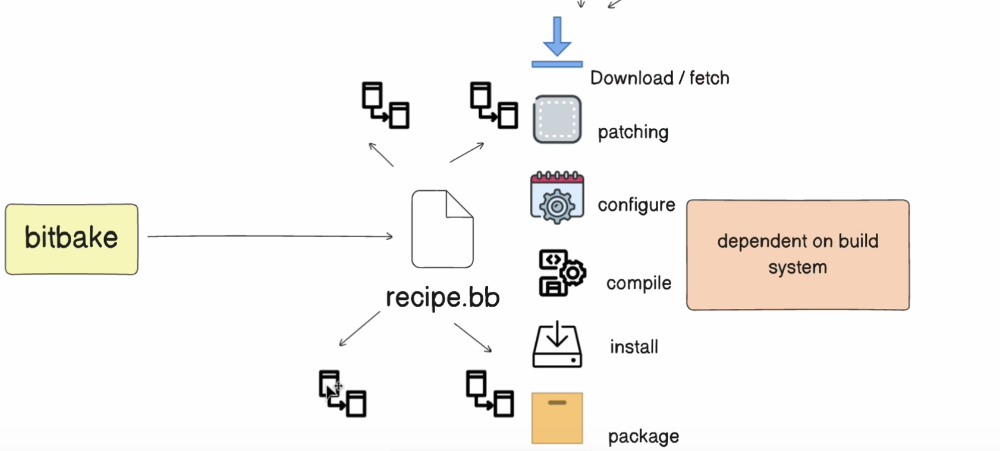

We will start with the **package** recipe 


# Package Recipes:
- Package recipe is just like an application package we install to our image, we will see how we are going to create a helloworld app and add this package to our image

**Using native c++ application**
1. Start by sourcing the build environment 
2. Create a new layer for the package by the following command:
```bash
cd build # Don't forget to go to the build dir
bitbake-layers create-layer ../meta-IVI # Don't forget to change the path to the correct one to be outside build
```
3. You will find a new dir called `meta-IVI` created  if you go to it you will find simple structre tree like :

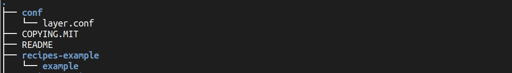

4. We will start by creating a new dir called `recipes-native-cpp` and inside it create another one called `helloworld` 
```bash
cd meta-IVI
mkdir -p recipes-native-cpp/helloworld
```

5. Inside the `helloworld` dir use the following command :
```bash
recipetool create -o helloworld_1.0.bb https://github.com/embeddedlinuxworkshop/y_t1 
```


6. then you will find that he has created a new recipe with the name `helloworld_1.0.bb`

7. open the `helloworld_1.0.bb` and make the stages of the compile and install like this, or just copy paste this content:
```bash
# Recipe created by recipetool
# This is the basis of a recipe and may need further editing in order to be fully functional.
# (Feel free to remove these comments when editing.)

# Unable to find any files that looked like license statements. Check the accompanying
# documentation and source headers and set LICENSE and LIC_FILES_CHKSUM accordingly.
#
# NOTE: LICENSE is being set to "CLOSED" to allow you to at least start building - if
# this is not accurate with respect to the licensing of the software being built (it
# will not be in most cases) you must specify the correct value before using this
# recipe for anything other than initial testing/development!
LICENSE = "CLOSED"
LIC_FILES_CHKSUM = ""

SRC_URI = "git://github.com/embeddedlinuxworkshop/y_t1;protocol=https;branch=master"

# Modify these as desired
PV = "1.0+git${SRCPV}"   # package version
SRCREV = "49600e3cd69332f0e7b8103918446302457cd950"  # The commit hash of github

S = "${WORKDIR}/git"  # The source code place on the device

# NOTE: no Makefile found, unable to determine what needs to be done


do_compile () {
	# Specify compilation commands here
	# change the permissions of the file to be executable
	
	$CXX ${S}/main.cpp -o hello
}

do_install () {
	# 1. Create dir ${workdir}/image/usr/bin
	install -d ${D}/${bindir}
	# 2. installing hello bin --> dir ${workdir}/image/usr/bin
	install -m 0755 ${S}/hello ${D}/${bindir}
}


# ignore the do_package_qa
do_package_qa[noexec] = "1"
```


7. let's bitbake the file :
```bash
bitbake helloworld
```

8. then you can see the output of the file which is the hello.out file in the path `${workdir}/image/usr/bin`
, but How to get the workdir value? you can get it by using the following command:
```bash
# this will get the environment variables of the helloworld recipe
bitbake -e helloworld | grep ^WORKDIR
```
9. now we are done with the recipe baking


## Image Recipes:
- **What's the Image recipe?** The Image recipe it's output is a rootfs with specific file system, this fs is excpected to be on the target
- If you remember the `core-image-minimal` this is an image recipe for a very simple recipe that's used just to boot the device 
- We have some Image recipes gahza 3andi , to see it use : 
```bash
ls meta*/recipes*/images/*.bb
```


Those are the Image recipes that exist on my device


- If we inspected the `core-image-minimal` recipe you will find that it has the following inhertance :

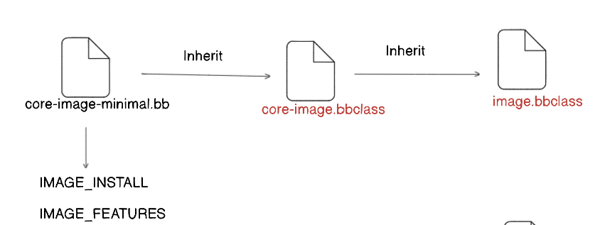

It inherets from `core-image.bbclass` and this ineherts from `image.bbclass`


- If we look at the `rpi-test-image.bb` you will find that it includes `core-image-base.bb` which inherets from `core-image.bbclass` and this ineherts from `image.bbclass`, but `rpi-test-image.bb` also has some addditional things like `package-group-rpi-test`


- ## **Let's start creating our image recipe :** 
    1. **for best practising we will go to our layer `meta-IVI` and then create a dir on it called `recipes-core` and inside it `images` and then create our recipe file `helloworld_1.0.bb`**

     - it will result the following structure :
     - 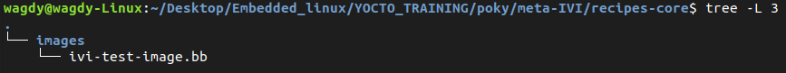


     2. **Open the recipe and use the following** :
     ```bash
        # We will follow the following stes 
        # 1. include the base image
        # 2. Setting some local variables
        # 3. IMAGE_INSTALL & IMAGE_FEATURES 

        # we will take the base image as the raspberrypi image

        require recipes-core/images/rpi-test-image.bb

        # 2. Setting some local variables
        SUMMARY = "IVI Testing Image that includes the rpi image + helloworld package we have    created"

        # 3. IMAGE_INSTALL & IMAGE_FEATURES
        IMAGE_INSTALL:append = " helloworld"
        IMAGE_FEATURES:append = " debug-tweaks"

     ```


# Two essentials concepts:
1. **IMAGE_INSTALL**: ***is adding a new package recipe to the rootfs of the image linux I'm creating***
2. **IMAGE_FEATURES**: ***is adding a new feature the package will be installed, like the ssh without password , this is a feature***, "The contents of images generated by the OpenEmbedded build system can be controlled by the IMAGE_FEATURES and EXTRA_IMAGE_FEATURES variables that you typically configure in your image recipes. Through these variables, you can add several different predefined packages such as development utilities or packages with debug information needed to investigate application problems or profile applications."


[!NOTE]
> **MACHINE_FEATURES:** Describes hardware capabilities and influences kernel modules/drivers.

>**DISTRO_FEATURES:** Describes software stack features, affecting all images built with the distribution.

>**IMAGE_FEATURES:** Adds specific functionality to individual images, such as extra packages or tools.


# Class Recipes: 
- **What's the class recipe?** It's like encapsulation for the common tasks and function to be in one file and then inhert this file to use the functions

- Let's create our class and use it in our layer
    - Go to `meta-IVI` dir and create a dir called `classes` and create file called `helloworld.bbclass` and we will use part of the image recipe just for calrification , we took the do_install function

    ```bash
    do_install () {
	# 1. Create dir ${workdir}/image/usr/bin
	install -d ${D}/${bindir}
	# 2. installing hello bin --> dir ${workdir}/image/usr/bin
	install -m 0755 ${S}/hello ${D}/${bindir}
    }
    # ignore the do_package_qa
    do_package_qa[noexec] = "1"
    ```
    - Then we can use the class anywhere by using the following command:
    ```bash
    inherit <nameOfClass>
    ```


# Real life project example:
Link of the project [here](https://bullet.guru/courses/embedded-linux-projects/lectures/57363366)

**Steps**
1. Read the c++ source code and define the dependancies of the code (openssl)
2. You will find that we need the openssl library
3. Now let's create our layer for example name it `meta-security`
4. Don't forget to add the layer to the bitbake layers
5. now create a this dirs in the layer `meta-security/recipes-apps/ `   
6. then create a recipe file called `hellossl_1.0.bb` and add the following content to it:
```bash
# recipe for anything other than initial testing/development!
LICENSE = "CLOSED"
LIC_FILES_CHKSUM = ""

SRC_URI = "file://main.cpp" 


# Documentaintion variables 
SUMMARY     = ""
DESCRIPTION =""
HOMEPAGE    = ""


# This is the most important part of the recipe
DEPENDS = "openssl"


# Modify these as desired
PV = "1.0"


S = "${WORKDIR}"

# NOTE: no Makefile found, unable to determine what needs to be done

do_configure () {
	# Specify any needed configure commands here
	:
}

do_compile () {
	
    ${CXX} ${S}/main.cpp  -lssl -lcrypto -o hellossl
}

do_install () {
	# Specify install commands here
	:
	
}
do_package_qa[noexec]="1"

``` 

   - **Note**: We need to know if the openssl recipe is already made by someone before , so we go to [here](https://layers.openembedded.org/layerindex/branch/master/recipes/?q=openssl) we will find the recipe in a layer called openembedded-core , and we have it already just we have to mention the keyword `DEPEND` in our application revcipe , it will go and search for a recipe with the name `openssl` 
   - What going to happen in this step is bitbake will copy the content of the openssl workdir to the workdir of the hellossl recipe and then it will compile the hellossl recipe

7. then bitbake the recipe file

8. add the pocky.sh script to the bashrc file and then source it , this script has an important function called `go_recipe` this function takes you to the WORKDIR of the recipe we are mentioning, this `WORKDIR` is so IMPORTANT

9. 	for the line `${CXX} ${S}/main.cpp  -lssl -lcrypto -o hellossl` this line specifies the compiler and the static library of the ssl , so when we bitbake this it will go to the `WORKDIR` and go to `recipe-sysroot` and then go to the `usr/lib` and then find the `libssl.a` and then it will link it to the hellossl file


10. After we have created the recipe for this app we will find it's content in the `WORDIR` of the recipe in usr/bin/hellossl , but that's not in the image ,to add it to the image we will have to add it to the `IMAGE_INSTALL = hellossl` in the image recipe file , now we have a package for this app called `hellossl`


# Adding nano to our Image:
before going into creating the recipe for the program, check if this program is exist inside other layers , to search use the following command :
```bash
bitbake-layers show-recipes <packagename>
#for example we here is working with nano 
bitbake-layers show-recipes nano
```
1. as we see in the above command nano is already there so all we need to do is to make sure that it's layer appeared is added in the `bblayer.conf` file
2. Then go to the image recipe and scroll down to `IMAGE_INSTALL` and add `nano` to it
3. bitbake the image recipe :)


# Adding RPI-Play with Cmake to our image:
1. First go to our layer `meta-IVI` and then add a new dir `recipes-info` inside it create a dir `rpi-play` and then use the following command inside it 
```bash
recipetool create -o rpi-play.bb https://github.com/FD-/RPiPlay.git # this is the link of the code for the `rpiplay`
```
2. But note that in the readme of the repo there's some dependancies , we gotta solve it and put it in the `DEPENDS` variables in the recipe

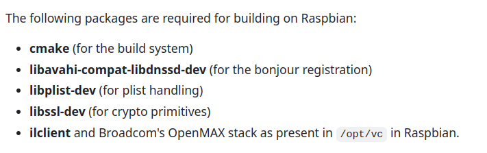

3. To know more about every dependacy search for it in the [here](https://layers.openembedded.org/layerindex/branch/master/recipes/)

4. after searching you will find out that we need this :

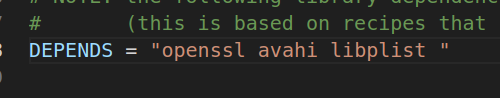

(((((((((((((RPI-play recipe has a problem , edit it and then add it to the image recipe and then bitbake the image recipe)))))))))))))


# Issues & Sol :
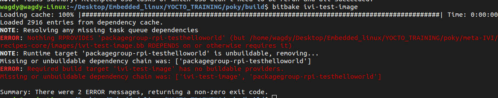


- **The issue was that I was using the feature debug-tweaks inside the image install option which is very idiot**
they should look like this :
```bash
IMAGE_INSTALL:append = " helloworld"
IMAGE_FEATURES:append = " debug-tweaks"
```


<br>
<br>
<br>
<br>
<br>
<br>
<br>
<br>
<br>
<br>
<br>
<br>
<br>
<br>
<br>
<br>
<br>
<br>
<br>
<br>
<br>
<br>
<br>
<br>
<br>
<br>
<br>
<br>


*************************************************************************************************************************************
****************************************************To be Documented **************************************************************


- in the tmp dir we have another dir called deploy inside it you will find images dir, it will look so messy and we can't use all of this to flash the board so we will use the flashing script we have created in the `flashing.sh` file with a tool called `wic` to convert it to iso image 


- to make the sd-card bootable , we should have two partitionsthe boot partition should be `fat32` and the root partition should be `ext4` so we can create all of that manually or we can use tools like `wic` to do that for us


- Distro = Kernel + Application installed in the userspace , so we create the distro to give us the ability to edit the apps or the choosing the kernel version , it's like choosing between Ubuntu and Fedora both are distros but they have different apps and kernel versions


- We can create recipes using the both tools `devtool add` and the `recipetool create`


- Devtool is more advanced than the recipy tool


- The devtool give us the capality to work like GIT it has some commands to workin the workspace and stay away from the src file , and when we finish the edits then we apply this to the original file


********** Scenario what happends inside the Yoctoand what's the interactions between the layers and the recipes: **********
********** Yocto Runtime: **********
1. when we run the command `bitbake rpi-test-image`
2. the bitbake will go the dir of `build/conf` and then open the file `local.conf` , the `local.conf` file contains the configurations of the build like the `MACHINE` and the `DISTRO` and the `LAYERS` and the `BB_NUMBER_THREADS` and the `PARALLEL_MAKE` , we care now about the `MACHINE` and the `DISTRO` 

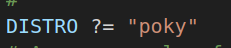

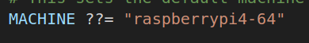


3. then it will open the `bblayers.conf` and load the `BBLAYERS` variable with the layers we have added to the bitbake

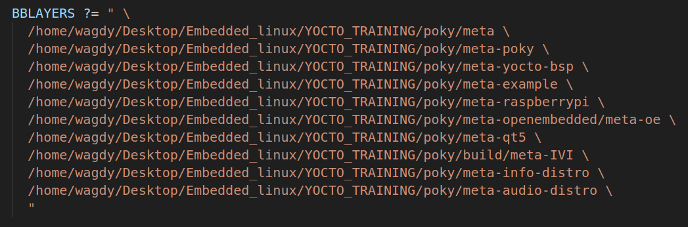

4. All the Variables and the data we read above will be loaded in the Data_Dictionary  

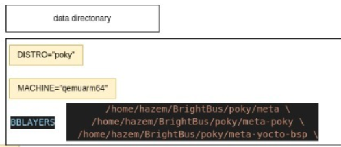


5. Then it will retrun from the data dictionary and deal with the Data_Dictionary we loaded 
6. it will start with doing the following steps :
    - Load the DISTRO conf if the variable DISTRO , so it will search for a file called `pocky.conf ` but why pocky? cuz we added in the DISTRO variable in the `local.conf` file pocky , search where? search in the layers he loaded in the `BBLAYERS`
    - When he goes to the `pocky.conf` it will also load the varaibles and the data on it to the Data_Dictionary
    - Now we fininshed the `DISTRO` , let's load the `MACHINE` varaible 
    - The `MACHINE` has the value of `raspberrypi4-64` so it will search for a file called `raspberrypi4-64.conf` in the layers he loaded in the `BBLAYERS`
    - After finding the file it will also load the variables and the data on it to the Data_Dictionary
    - Then it will search for a file called `rpi-test-image.bb` -> (this is the name of the thing we bitbaked first) in the layers he loaded in the `BBLAYERS`
    - This file is a recipe file it has variables and functions, it will load the variables inside the Data_Dictionary, but the vraiable from the recipe will be `local` not `global` , then it will execute the functions , one of the functions called `IMAGE_INSTALL` will have the 

    - 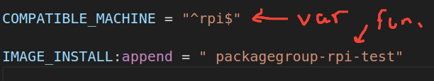

    - Inside the `packagegroup-rpi-test` it will find some apps names , it should make sure that's installed and exists inside all the layers 
    - If one of the applications is not exist it will show an error
    - Then it will deploy the Image to `output/tmp/deploy/images/raspberrypi4-64`

----------------------------------------------------------------------------------------------------------
- To get the environment varaibles of the bitbake , you can use the following command:
```bash
bitbake -e <recipename>
```

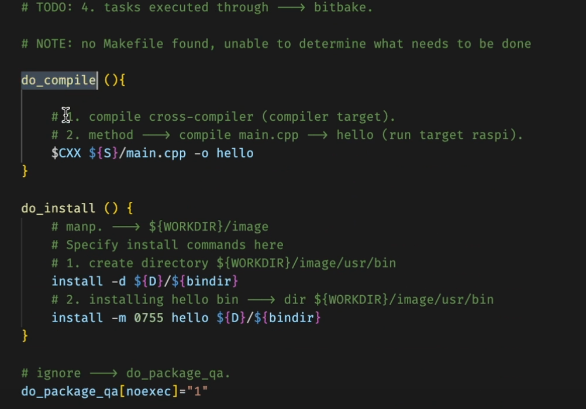


# What's the sysroot:
- it's the rootfs of the target machine on the host machine , and it's used for cross-compilation to make sure that the compiler uses the correct libraries and headers 
- it's also used to the consistency between the host and the target machine


*************************************************************************************************************************************
**************************************************** End of To be Documented ********************************************************


- Booting sequence of the Rasperrypi :
The bios of the rasp start searching for the bootable partition in the sd-card 