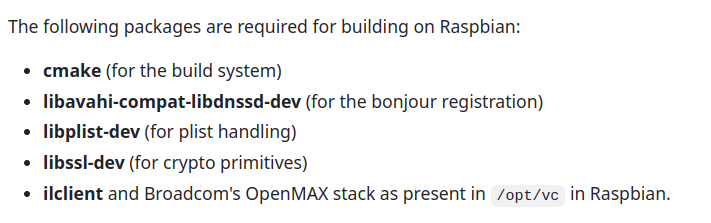
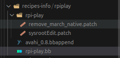

WAGDY
---

# Adding RPI-Play with CMake to our image

### Steps:

1. **Go to the `pocky` directory.**

2. **Go to your desired layer.**  
   We use `meta-IVI`, and we have already added it to the Bitbake layers. If you will create a new one, don't forget to add it using:  
   ```bash
   bitbake-layers add-layer <layername>
   ```

3. **Create a new directory called `recipes-info/rpiplay` inside your layer.**

4. **Reference the RPI-Play Official Repo:**  
   You can find the RPI-Play repository [here](https://github.com/FD-/RPiPlay/tree/master).

5. **Go to the `rpiplay` directory you created and start creating the recipe:**
   ```bash
   cd poky/meta-IVI/recipes-info/rpiplay
   recipetool create -o rpi-play.bb https://github.com/FD-/RPiPlay.git
   ```

6. **Handle dependencies:**  
   If you Bitbake the recipe now, you will face dependency errors. Let's solve these by checking the repository. These dependencies include:
   
   

7. **Use this website** to search for each library and determine which layer it requires:  
   [Layer Index](https://layers.openembedded.org/layerindex/branch/master/recipes/?q=nano)

8. **Edit the `rpi-play.bb` file to include dependencies:**  
   Add this to the `DEPENDS` variable:
   ```bash
   DEPENDS = "openssl avahi libplist userland gstreamer1.0 gstreamer1.0-plugins-base gstreamer1.0-plugins-good"
   ```

9. **Example `rpi-play.bb` file:**
   ```bash
   LICENSE = "Unknown"
   LIC_FILES_CHKSUM = "file://LICENSE;md5=1ebbd3e34237af26da5dc08a4e440464 \
                       file://lib/llhttp/LICENSE-MIT;md5=f5e274d60596dd59be0a1d1b19af7978 \
                       file://lib/playfair/LICENSE.md;md5=c7cd308b6eee08392fda2faed557d79a"

   SRC_URI = "git://github.com/FD-/RPiPlay.git;protocol=https;branch=master \
              file://sysrootEdit.patch"

   PV = "1.0+git${SRCPV}"
   SRCREV = "64d0341ed3bef098c940c9ed0675948870a271f9"
   S = "${WORKDIR}/git"

   DEPENDS = "openssl avahi libplist userland gstreamer1.0 gstreamer1.0-plugins-base gstreamer1.0-plugins-good"

   inherit cmake pkgconfig

   TARGET_LDFLAGS      += "-Wl,--copy-dt-needed-entries"
   EXTRA_OEMAKE:append  = 'LDFLAGS="${TARGET_LDFLAGS}"'
   ```

10. **Create a patch file inside the `rpi-play` directory:**
    - Create another directory called `rpi-play`.
    - Create a patch file named `sysrootEdit.patch`.

11. **File structure should be as follows:**

    

12. **Add the following data to the `sysrootEdit.patch` file:**
   ```bash
   diff --git a/renderers/CMakeLists.txt b/renderers/CMakeLists.txt
   index e561250..2524d3c 100755
   --- a/renderers/CMakeLists.txt
   +++ b/renderers/CMakeLists.txt
   @@ -7,7 +7,7 @@ endif()
   
    if( CMAKE_SYSTEM_PROCESSOR MATCHES "(x86)|(X86)|(amd64)|(AMD64)" )
   -    set( CMAKE_C_FLAGS "${CMAKE_C_FLAGS} -Ofast -march=native" )
   +    set( CMAKE_C_FLAGS "${CMAKE_C_FLAGS} -Ofast -mcpu=cortex-a7 -mfpu=neon-vfpv4 -mfloat-abi=hard" )
    endif()

    set( RENDERER_LINK_LIBS "" )
    set( RENDERER_INCLUDE_DIRS "" )
   
    find_library( BRCM_GLES_V2 brcmGLESv2 HINTS ${CMAKE_SYSROOT}/usr/lib/ )
    find_library( BRCM_EGL brcmEGL HINTS ${CMAKE_SYSROOT}/usr/lib/ )
    find_library( OPENMAXIL openmaxil HINTS ${CMAKE_SYSROOT}/usr/lib/ )
    find_library( BCM_HOST bcm_host HINTS ${CMAKE_SYSROOT}/usr/lib/ )
    find_library( VCOS vcos HINTS ${CMAKE_SYSROOT}/usr/lib/ )
    find_library( VCHIQ_ARM vchiq_arm HINTS ${CMAKE_SYSROOT}/usr/lib/ )
   
    if( BRCM_GLES_V2 AND BRCM_EGL AND OPENMAXIL AND BCM_HOST AND VCOS AND VCHIQ_ARM )
       message( STATUS "Found OpenMAX libraries for Raspberry Pi" )
    include_directories( ${CMAKE_SYSROOT}/usr/include/ 
   ```

13. **Create another file called `avahi_0.8.bbappend` in the main directory of `rpi-play` and add the following content:**
   ```bash
   PACKAGECONFIG += "libdns_sd"

   do_install:append(){
   install -m 0664 ${WORKDIR}/${PN}-${PV}/avahi-compat-libdns_sd/* ${D}/${includedir}/
   }
   ```

14. **Finally, update the `userland_git.bb` file:**
    Add the following line at the end of the file (usually located at `poky/meta-raspberrypi/recipes-graphics/userland/userland_git.bb`):
    ```bash
    SYSROOT_DIRS:append=" ${prefix}/src"
    ```


15. Then bitbake the rpi-play and congrats :)
    ```bash
    bitbake rpi-play
    ```

    
--- 

