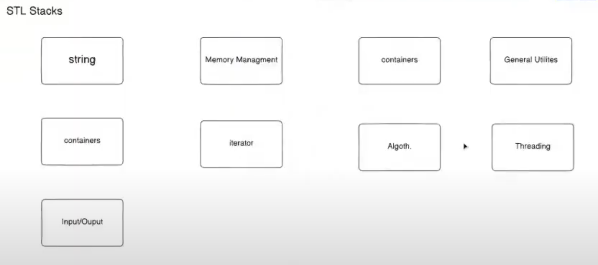

# STL main features:
   - 


## Containers: 
 - set of data-structure contains form in memory 
 - Types: 
    - **Sequence containers**: 
        - vector, list, deque, array, forward_list

    - **Associative containers**:
        - set, multiset, map, multimap


    # Arrays:
    ```cpp
        #include <array>
        #include <iostream>


        int main(){
            // declaration of array
            std::array<int ,5> arr = {1,2,3,4,5};

            // accessing elementns , If I accessed an element out of the range of the array it will not give me an error
            std::cout<<arr[0]<<std::endl;
            

            // accessing elements with boundary checks:
            std::cout<<arr.at(0)<<std::endl;

            //accessing first element
            std::cout<<arr.front()<<std::endl;


            // checking capacity 
            std::cout<<arr.empty() <<std::endl;

            // getting the max value of the array (mlhash lazma fel arrays)
            std::cout<<arr.max_size() <<stdd::endl;

            // filling the array with element instead of making for loop
            arr.fill(0);

        }
    ```  
    # Vectors:  
        it's the same like the arrays but dynamically changed in the program runtime
        it also has the same functions as the array

        - but for the capacity it's crucial here cuz the vector enable us to take memory from the heap so when we use the `max_size` it will return the available memory of the heap


    # Lists:
       it's like the vector but the difference in the memory allocation , they are not next to each others but they are linked with the pointers


    # Iterator : 
        it's just a datatype to connect the `algorithms` to the `containers`  
        we have functions that returns iterators like:  `beign()` and `end()`

