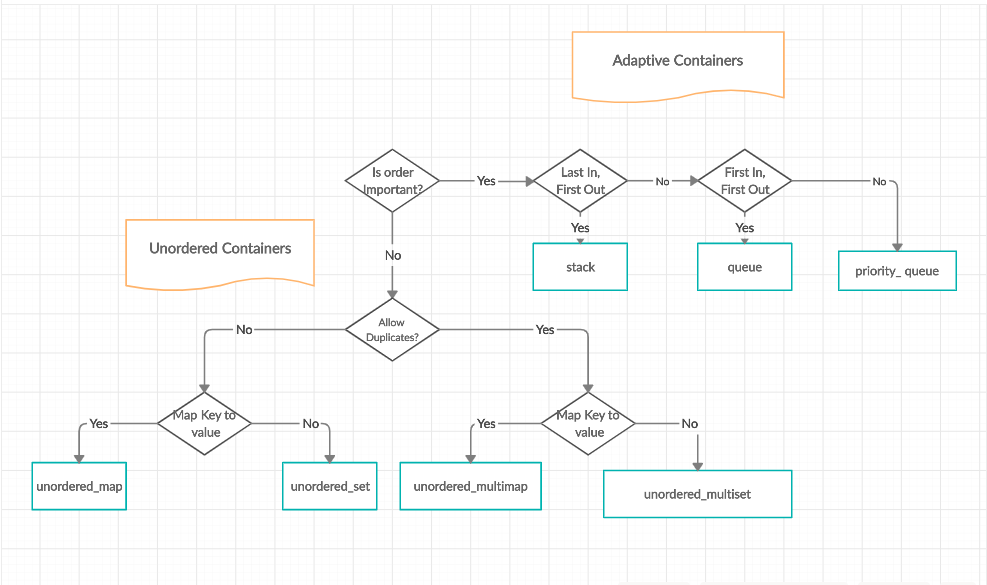
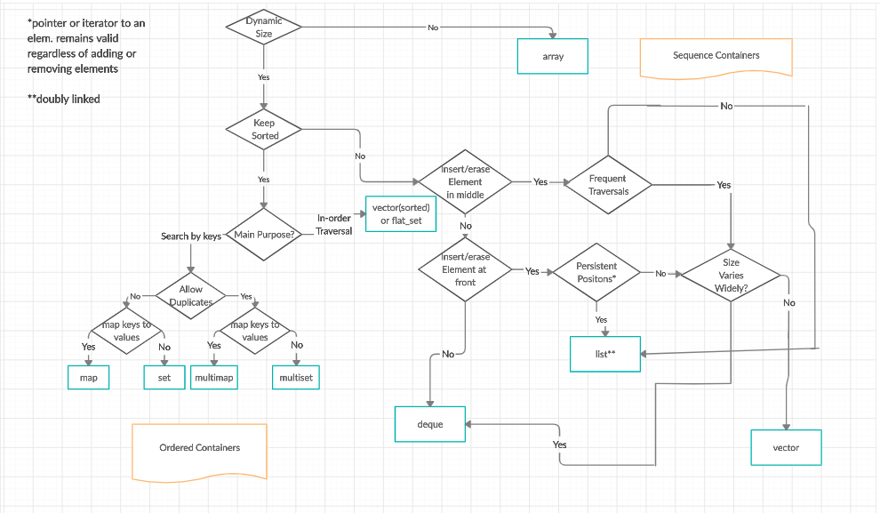

# 🪓  Modern Cpp Module  🪓
## 1. 🧙🏻‍♂️ Basics
###  🦖 Modifiers:
In C++, modifiers are keywords that modify the behavior of fundamental data types. They can be used to alter the size or properties of a data type. Here are some common modifiers in C++:

- **🤔 const**: This keyword is used to declare constants. It indicates that the value of a variable cannot be changed after it is initialized.

    - `const int myConstVar = 10; `


- **🤔 volatile**: This keyword is used to indicate that a variable may be changed by some external factors, such as hardware, and should not be optimized by the compiler.

    - `volatile int sensorValue`; 


- **🤔 mutable**: It is used in a class to allow a particular data member to be modified even if the object is declared as const.

    - `class Example { public: mutable int mutableVar; };` 

- **🤔 static**: When used with variables, it makes the variable retain its value between function calls. When used with functions, it makes the function a class function rather than an instance function.

    - `static int staticVar; static void staticFunction();`

- **🤔 extern**: It is used to declare a variable or function that is defined in another file or in an external library.

    - `extern int externVar; extern void externFunction(); `


- **🤔 constexpr**: This keyword is used to declare variables that are evaluated at compile time. It can also be used to define functions that are evaluated at compile time, The key point of constexpr is that it can be executed at compile time. Your code may have been executed before you run it. That’s the main point.

---
### 🦖 Coding Guidelines:
1. **Always initialize variables when you declare them**.
    - for the string , it's intialized by default to empty string.

2. **Don't use endl to end a line, use '\n' instead for performance reasons**.

3. **Stop using the magic number , Don't use nmbers in the code instead make a varaible with this name and make it understandable**

4. **Don't use the C array , instead use the array from the STL,This gives more features and saftey to the code**.

5. **Every case in the switch statement should have a break statement**.

---

### 🦖Arrays:
In modern c++ we don't use the C arrays , we include the array instead , this gives us more features and safety.

- ```cpp
    #include <array>
    using namespace std;
    array<int, 5> myArray = {1, 2, 3, 4, 5}; //myArray is the name of the array
  ```


### 🦖Stirng:
In modern c++ We have String from STL.

- ```cpp
    #include <string>
    using namespace std; 
    string name="Ahmed";
    //operations on string
    name.size();        //return the size of the string
    name.empty();       //return true if the string is empty
    name.clear();       //clear the string
    name.substr(0,3);   //return the substring from index 0 to 3
    name.max_size();    //return the max size of the string can reach
    name.length();      //return the length of the string -> same as size()
    name.push_back('a'); //add the char 'a' to the end of the string
  ```


### 🦖**Containers** :
**Flowchart of Adaptive Containers and Unordered Containers**



**Flowchart of Sequence containers and ordered containers**




### 🦖**operator overloading**:

**Operator overloading in C++ allows you to redefine the behavior of operators (like +, -, ==, etc.) for user-defined types (e.g., classes or structs). By overloading operators, you can make instances of your custom classes work intuitively with C++ operators.**

```bash
class Complex {
  private: int real,
  imag;

  public: Complex(int r = 0, int i = 0) {
      real = r;
      imag = i;
  }

  // This is automatically called when '+' is used with
  // between two Complex objects
  Complex operator + (Complex
      const & obj) {
      Complex res;
      res.real = real + obj.real;
      res.imag = imag + obj.imag;
      return res;
  }
  void print() {
      cout << real << " + i" << imag << '\n';
  }
};
```


**As we can see the operator overloading done with the retrun type of Complex , why? cuz we create a class object called `res` and we return it**


---
### 🔗 Dynamic linking vs static linking:

- **Dynamic Linking**: In dynamic linking, the linking of the program is done at run-time. The linking is done when the program is loaded into memory. 
- **Static Linking**: In static linking, the linking of the program is done at compile-time. The linking is done when the program is compiled. *We resolve the cpp file and the library file at compile time*.


## **Example**

Sure! Let's walk through examples of creating and using both a **dynamic library (shared library)** and a **static library** in C++. These examples will cover creating the library, compiling it, and linking it with a main program.

### 1. **Dynamic Library Example**
We'll create a simple dynamic library (shared library) with a function that adds two integers, and then use that function in a program.

#### Step 1: Create the Dynamic Library

```cpp
// mathlib.cpp
#include <iostream>

int add(int a, int b) {
    return a + b;
}
```

#### Step 2: Compile the Dynamic Library

On Linux, you can compile the `mathlib.cpp` file into a shared library (`.so` file) using the following commands:

```bash
g++ -fPIC -c mathlib.cpp   # Compile the source file to an object file with Position Independent Code (PIC)
g++ -shared -o libmathlib.so mathlib.o  # Create the shared library
```

- `-fPIC`: Generates position-independent code, which is required for shared libraries.
- `-shared`: Creates a shared library.

#### Step 3: Create the Main Program that Uses the Dynamic Library

```cpp
// main.cpp
#include <iostream>

// Declare the function from the shared library
extern int add(int, int);

int main() {
    int result = add(5, 3);
    std::cout << "The result is: " << result << std::endl;  // Should print "The result is: 8"
    return 0;
}
```

#### Step 4: Compile and Link the Program with the Dynamic Library

```bash
g++ -o main main.cpp -L. -lmathlib
```

- `-L.`: Specifies the current directory (where the shared library is located).
- `-lmathlib`: Links against the `libmathlib.so` shared library.

#### Step 5: Run the Program

Before running the program, ensure that the system knows where to find the shared library. You can do this by setting the `LD_LIBRARY_PATH` environment variable:

```bash
export LD_LIBRARY_PATH=.
./main
```

This should print `The result is: 8`.

### 2. **Static Library Example**
Now, let's create a static library that performs the same task and use it in a program.

#### Step 1: Create the Static Library

We'll use the same `mathlib.cpp` file:

```cpp
// mathlib.cpp
#include <iostream>

int add(int a, int b) {
    return a + b;
}
```

#### Step 2: Compile the Static Library

On Linux, you can compile the `mathlib.cpp` file into a static library (`.a` file) using the following commands:

```bash
g++ -c mathlib.cpp  # Compile the source file to an object file
ar rcs libmathlib.a mathlib.o  # Create the static library archive
```

- `ar rcs`: Stands for "archive, replace, create, sort". This creates a static library archive from the object file.

#### Step 3: Create the Main Program that Uses the Static Library

```cpp
// main.cpp
#include <iostream>

// Declare the function from the static library
extern int add(int, int);

int main() {
    int result = add(5, 3);
    std::cout << "The result is: " << result << std::endl;  // Should print "The result is: 8"
    return 0;
}
```

This is the same main program as before.

#### Step 4: Compile and Link the Program with the Static Library

```bash
g++ -o main main.cpp -L. -lmathlib
```

- `-L.`: Specifies the current directory (where the static library is located).
- `-lmathlib`: Links against the `libmathlib.a` static library.

Unlike shared libraries, there’s no need to set an environment variable when using static libraries because the library code is directly included in the executable during linking.

#### Step 5: Run the Program

Simply run the compiled program:

```bash
./main
```

This should print `The result is: 8`.

### Key Differences:
- **Shared Library**: You created a `.so` file, and the library code is loaded dynamically at runtime. The executable is smaller, and you needed to set the `LD_LIBRARY_PATH` to point to the shared library location before running the program.
- **Static Library**: You created a `.a` file, and the library code is copied into the executable at compile time. The executable is larger, but no runtime linking is required, and the program can be run directly.

These examples demonstrate how to create and use both dynamic and static libraries in C++. If you have any specific questions or need further details, feel free to ask!


---

## How to add a Header file to the system ? 

To make a header file available to all C++ files on your system, you have several options, depending on how you want to manage and distribute this header file. Below are different approaches:

### 1. **System-Wide Header Installation**
You can install the header file in a system-wide location, such as `/usr/include` or `/usr/local/include` on Linux/macOS, or in a system-wide directory on Windows.

#### **Linux/macOS**
- Place the header file in a directory that is part of the system's default include paths, such as `/usr/include` or `/usr/local/include`.
  
  For example:
  ```bash
  sudo cp your_header.h /usr/local/include/
  ```

- Once copied to this directory, the header can be included in any C++ file like this:
  
  ```cpp
  #include <your_header.h>
  ```

- The compiler automatically searches these system include directories, so you don’t need to specify an additional `-I` flag when compiling.


### 2. **Custom Include Directory (Without Modifying System Directories)**
If you don't want to modify system directories, you can store your header files in a custom directory and tell your compiler to include that directory for all your projects.

#### Step 1: Create a Custom Include Directory
- Create a directory to store your headers, e.g., `~/my_includes/` on Linux/macOS or `C:\my_includes\` on Windows.
  
#### Step 2: Add the Directory to the Compiler’s Include Path
- When compiling, use the `-I` flag to specify the custom include directory.

  ```bash
  g++ -I ~/my_includes/ -o my_program main.cpp
  ```

  This will allow your program to include headers from that directory:

  ```cpp
  #include <your_header.h>
  ```

#### Make It Permanent
- To avoid specifying `-I` every time you compile, you can modify your `Makefile`, CMake configuration, or environment variables to always include the custom directory. For example, in a `Makefile`:

  ```make
  CXXFLAGS += -I~/my_includes
  ```

- You can also set the `CPLUS_INCLUDE_PATH` environment variable on Linux/macOS:

> 7elwa diiii

  ```bash
  export CPLUS_INCLUDE_PATH=~/my_includes
  ```

  This tells the compiler to search the specified directory for headers without needing to use the `-I` option every time.


