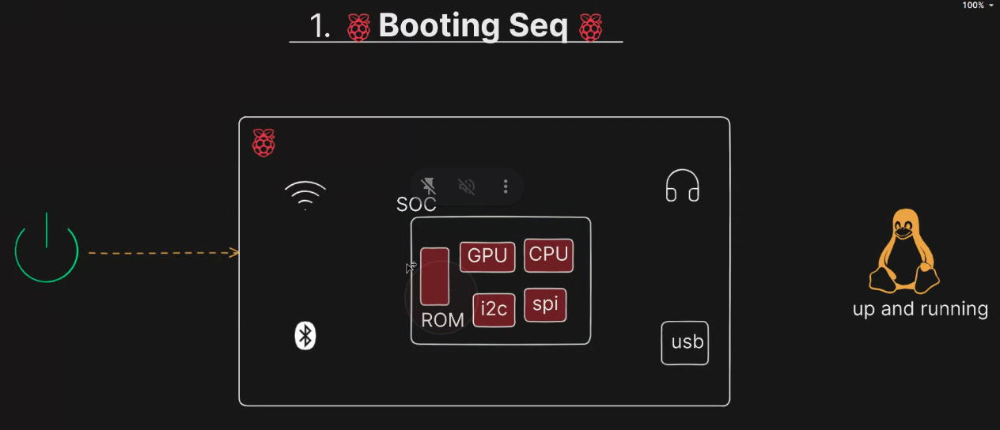

# Raspi booting sequence:
   - 

1. Power on the Raspberry Pi , we have rom inside the raspberry pi which contains the bootloader code , then the `GPU` starts the first bootloader(the first bootloader is soc specific it's like dell or hp) (while the second bootloader is raspberry pi specific)

2. Then the first bootloader will call the second bootloader (in file bootcode.bin) which is in `EEPROM` and it will excuted by the `GPU` also, then the 2nd bootloader enables me to choose `BOOT_ORDER` which storage device to boot from (SD card, USB, etc)  , we will set the first thing is to be the sdcard , the GPU will boot from the sdcard.

3. Gpu will search in the `/boot` partition for the 3rd bootloader and then it will load the kernel image and the device tree and the config.txt file.

[//]: <> (but what about the elf file and the kernel image and the device tree and the config.txt file ? )

4. the elf file is the 3rd bootloader which is the `start.elf` file , it will load the kernel image and the device tree and the config.txt file.

